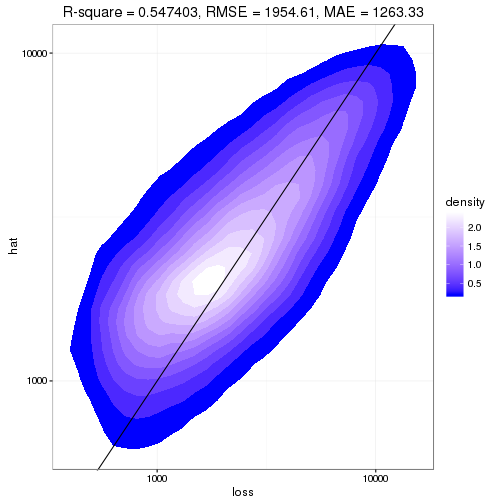
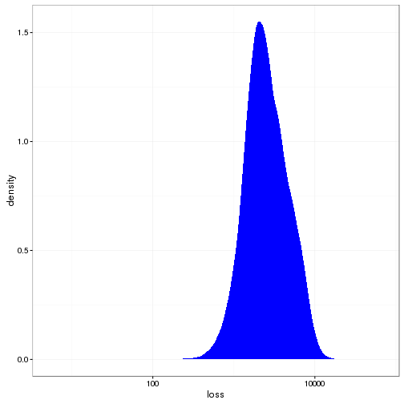

---

# Preamble

Set working directory.


```r
setwd("~/Projects/Kaggle/AllstateClaimsSeverity/scripts")
```

Load libraries.


```r
library(plyr)
library(dplyr)
```

```
## 
## Attaching package: 'dplyr'
```

```
## The following objects are masked from 'package:plyr':
## 
##     arrange, count, desc, failwith, id, mutate, rename, summarise,
##     summarize
```

```
## The following objects are masked from 'package:stats':
## 
##     filter, lag
```

```
## The following objects are masked from 'package:base':
## 
##     intersect, setdiff, setequal, union
```

```r
library(reshape2)
library(ggplot2)
library(caret)
```

```
## Loading required package: lattice
```

```r
library(xgboost)
```

```
## 
## Attaching package: 'xgboost'
```

```
## The following object is masked from 'package:dplyr':
## 
##     slice
```

```r
library(parallel)
library(doParallel)
```

```
## Loading required package: foreach
```

```
## Loading required package: iterators
```

Reproducibility steps.


```r
sessionInfo()
```

```
## R version 3.3.1 (2016-06-21)
## Platform: x86_64-redhat-linux-gnu (64-bit)
## Running under: CentOS release 6.8 (Final)
## 
## locale:
##  [1] LC_CTYPE=en_US.iso885915       LC_NUMERIC=C                  
##  [3] LC_TIME=en_US.iso885915        LC_COLLATE=en_US.iso885915    
##  [5] LC_MONETARY=en_US.iso885915    LC_MESSAGES=en_US.iso885915   
##  [7] LC_PAPER=en_US.iso885915       LC_NAME=C                     
##  [9] LC_ADDRESS=C                   LC_TELEPHONE=C                
## [11] LC_MEASUREMENT=en_US.iso885915 LC_IDENTIFICATION=C           
## 
## attached base packages:
## [1] parallel  stats     graphics  grDevices utils     datasets  base     
## 
## other attached packages:
##  [1] doParallel_1.0.10 iterators_1.0.8   foreach_1.4.3    
##  [4] xgboost_0.4-4     caret_6.0-71      lattice_0.20-34  
##  [7] ggplot2_2.1.0     reshape2_1.4.1    dplyr_0.5.0      
## [10] plyr_1.8.4        rmarkdown_1.0     knitr_1.14       
## [13] checkpoint_0.3.16
## 
## loaded via a namespace (and not attached):
##  [1] Rcpp_0.12.7        formatR_1.4        nloptr_1.0.4      
##  [4] methods_3.3.1      tools_3.3.1        digest_0.6.10     
##  [7] lme4_1.1-12        evaluate_0.9       tibble_1.2        
## [10] gtable_0.2.0       nlme_3.1-128       mgcv_1.8-15       
## [13] Matrix_1.2-7.1     DBI_0.5-1          SparseM_1.72      
## [16] stringr_1.1.0      MatrixModels_0.4-1 stats4_3.3.1      
## [19] grid_3.3.1         nnet_7.3-12        data.table_1.9.6  
## [22] R6_2.1.3           minqa_1.2.4        car_2.1-3         
## [25] magrittr_1.5       scales_0.4.0       codetools_0.2-14  
## [28] htmltools_0.3.5    MASS_7.3-45        splines_3.3.1     
## [31] assertthat_0.1     pbkrtest_0.4-6     colorspace_1.2-6  
## [34] quantreg_5.29      stringi_1.1.1      munsell_0.4.3     
## [37] chron_2.3-47
```

```r
set.seed(as.integer(as.Date("2016-10-10")))
```

Source user-defined functions.


```r
sapply(list.files("../lib", full.names = TRUE), source)
```

```
##         ../lib/mae.R ../lib/summaryMAE.R
## value   ?            ?                  
## visible FALSE        FALSE
```

---

# Read data

Read the training data.

Using `download.file` and `unzip` returns an error message:


```r
url <- "https://www.kaggle.com/c/allstate-claims-severity/download/train.csv.zip"
f <- tempfile()
download.file(url, f, mode = "wb")
unzip(f, list = TRUE)
```

```
Error in unzip(f, list = TRUE) : 
  zip file 'C:\Users\chanb\AppData\Local\Temp\1\Rtmpohg9qM\filedb017386a2d' cannot be opened
```

So I'll workaround by saving the zip files manually to `../data/raw` and `unzip`ing from there.


```r
unzip("../data/raw/train.csv.zip", exdir = tempdir())
train <- read.csv(file.path(tempdir(), "train.csv"), stringsAsFactors = TRUE)
unzip("../data/raw/test.csv.zip", exdir = tempdir())
test <- read.csv(file.path(tempdir(), "test.csv"), stringsAsFactors = TRUE)
```

List the columns in both data sets.


```r
merge(data.frame(col = names(train), inTrain = TRUE),
      data.frame(col = names(test), inTest = TRUE),
      by = "col", all = TRUE) %>%
  filter(inTrain & inTest) %>%
  .[, "col"]
```

```
##   [1] cat1   cat10  cat100 cat101 cat102 cat103 cat104 cat105 cat106 cat107
##  [11] cat108 cat109 cat11  cat110 cat111 cat112 cat113 cat114 cat115 cat116
##  [21] cat12  cat13  cat14  cat15  cat16  cat17  cat18  cat19  cat2   cat20 
##  [31] cat21  cat22  cat23  cat24  cat25  cat26  cat27  cat28  cat29  cat3  
##  [41] cat30  cat31  cat32  cat33  cat34  cat35  cat36  cat37  cat38  cat39 
##  [51] cat4   cat40  cat41  cat42  cat43  cat44  cat45  cat46  cat47  cat48 
##  [61] cat49  cat5   cat50  cat51  cat52  cat53  cat54  cat55  cat56  cat57 
##  [71] cat58  cat59  cat6   cat60  cat61  cat62  cat63  cat64  cat65  cat66 
##  [81] cat67  cat68  cat69  cat7   cat70  cat71  cat72  cat73  cat74  cat75 
##  [91] cat76  cat77  cat78  cat79  cat8   cat80  cat81  cat82  cat83  cat84 
## [101] cat85  cat86  cat87  cat88  cat89  cat9   cat90  cat91  cat92  cat93 
## [111] cat94  cat95  cat96  cat97  cat98  cat99  cont1  cont10 cont11 cont12
## [121] cont13 cont14 cont2  cont3  cont4  cont5  cont6  cont7  cont8  cont9 
## [131] id    
## 132 Levels: cat1 cat10 cat100 cat101 cat102 cat103 cat104 cat105 ... loss
```

Check that the columns in `train` are the same as in `test`.
Show the columns that are not in both data sets.


```r
merge(data.frame(col = names(train), inTrain = TRUE),
      data.frame(col = names(test), inTest = TRUE),
      by = "col", all = TRUE) %>%
  filter(is.na(inTrain) | is.na(inTest))
```

```
##    col inTrain inTest
## 1 loss    TRUE     NA
```

---

# Explore sample

Take a sample of the `train` data for exploration.


```r
sample <- filter(train, id %in% sample(train$id, length(train$id) * 0.05))
nrow(sample)
```

```
## [1] 9415
```

Plot the density of the `loss` variable.


```r
summary(sample$loss)
```

```
##    Min. 1st Qu.  Median    Mean 3rd Qu.    Max. 
##      11    1226    2138    3036    3903   41150
```

```r
ggplot(sample, aes(x = loss)) +
  geom_density(color = NA, fill = "blue") +
  scale_x_log10() +
  theme_bw()
```


## Continuous predictors

Plot bivariate densities between `loss` and the `cont` variables.
Look for patterns or clusterings with `loss`.


```r
select(sample, matches("loss|cont")) %>%
  melt(id.vars = c("loss")) %>%
  ggplot(aes(x = value, y = loss, group = variable)) +
    scale_y_log10() +
    stat_density_2d(aes(fill = ..level..), geom = "polygon") +
    scale_fill_gradient("density", low = "blue", high = "white") +
    facet_wrap(~ variable) +
    theme_bw()
```


Show summary statistics for `cont` variables.


```r
select(sample, matches("cont")) %>% summary()
```

```
##      cont1              cont2              cont3              cont4       
##  Min.   :0.000016   Min.   :0.001503   Min.   :0.002634   Min.   :0.1769  
##  1st Qu.:0.344779   1st Qu.:0.358319   1st Qu.:0.336963   1st Qu.:0.3184  
##  Median :0.475784   Median :0.555782   Median :0.527991   Median :0.4529  
##  Mean   :0.491986   Mean   :0.505485   Mean   :0.499569   Mean   :0.4873  
##  3rd Qu.:0.614340   3rd Qu.:0.681761   3rd Qu.:0.634224   3rd Qu.:0.6333  
##  Max.   :0.977873   Max.   :0.862654   Max.   :0.944251   Max.   :0.9525  
##      cont5            cont6             cont7            cont8       
##  Min.   :0.2811   Min.   :0.01268   Min.   :0.0695   Min.   :0.2369  
##  1st Qu.:0.2811   1st Qu.:0.33506   1st Qu.:0.3502   1st Qu.:0.3180  
##  Median :0.4223   Median :0.43863   Median :0.4357   Median :0.4352  
##  Mean   :0.4882   Mean   :0.48810   Mean   :0.4828   Mean   :0.4846  
##  3rd Qu.:0.6433   3rd Qu.:0.64862   3rd Qu.:0.5895   3rd Qu.:0.6123  
##  Max.   :0.9813   Max.   :0.98902   Max.   :1.0000   Max.   :0.9802  
##      cont9             cont10           cont11            cont12       
##  Min.   :0.00008   Min.   :0.0000   Min.   :0.03532   Min.   :0.03623  
##  1st Qu.:0.35897   1st Qu.:0.3646   1st Qu.:0.30763   1st Qu.:0.30839  
##  Median :0.43318   Median :0.4557   Median :0.45720   Median :0.46229  
##  Mean   :0.48393   Mean   :0.4956   Mean   :0.49070   Mean   :0.49051  
##  3rd Qu.:0.55855   3rd Qu.:0.6146   3rd Qu.:0.67209   3rd Qu.:0.66903  
##  Max.   :0.99133   Max.   :0.9948   Max.   :0.99535   Max.   :0.99455  
##      cont13             cont14      
##  Min.   :0.000228   Min.   :0.1808  
##  1st Qu.:0.315758   1st Qu.:0.2953  
##  Median :0.363547   Median :0.4006  
##  Mean   :0.491356   Mean   :0.4963  
##  3rd Qu.:0.687115   3rd Qu.:0.7249  
##  Max.   :0.948826   Max.   :0.8447
```

Show the standard deviations of the `cont` variables.


```r
select(sample, matches("cont")) %>% var() %>% diag() %>% sqrt()
```

```
##     cont1     cont2     cont3     cont4     cont5     cont6     cont7 
## 0.1871571 0.2064213 0.2015206 0.2109135 0.2106000 0.2032874 0.1774642 
##     cont8     cont9    cont10    cont11    cont12    cont13    cont14 
## 0.1962737 0.1817104 0.1842177 0.2079167 0.2073189 0.2112968 0.2227996
```

The `cont` variables are pre-scaled with values between 0, 0.999998.
Therefore, no preprocessing is needed.

Plot bivariate densities between `cont` variables.
Look for correlations to reduce dimensionality of data.


```r
corr <-
  select(sample, matches("cont")) %>%
  cor()
contHighCorr <- colnames(corr)[findCorrelation(corr)]
sprintf("Remove variable due to high pair-wise correlation with other variables: %s",
        contHighCorr)
```

```
## [1] "Remove variable due to high pair-wise correlation with other variables: cont9" 
## [2] "Remove variable due to high pair-wise correlation with other variables: cont12"
```

```r
replace(corr, which(upper.tri(corr, diag = TRUE)), NA) %>%
  melt(na.rm = TRUE) %>%
  ggplot(aes(x = Var1, y = Var2, fill = value)) + 
    geom_tile(color = "white") +
    scale_fill_gradient2(low = "blue",
                         high = "red",
                         mid = "white",
                         midpoint = 0,
                         limit = c(-1, 1),
                         space = "Lab",
                         name="R") +
    theme_minimal() +
    theme(axis.text.x = element_text(angle = 45, vjust = 1, hjust = 1),
          axis.title.x = element_blank(),
          axis.title.y = element_blank(),
          panel.grid.major = element_blank()) +
    coord_fixed()
```


```r
round(corr, 2)
```

```
##        cont1 cont2 cont3 cont4 cont5 cont6 cont7 cont8 cont9 cont10 cont11
## cont1   1.00 -0.08 -0.44  0.36 -0.02  0.76  0.37  0.36  0.93   0.81   0.60
## cont2  -0.08  1.00  0.44  0.06  0.20  0.01  0.03  0.14 -0.02   0.07   0.11
## cont3  -0.44  0.44  1.00 -0.33  0.09 -0.36  0.10 -0.19 -0.42  -0.32   0.02
## cont4   0.36  0.06 -0.33  1.00  0.17  0.21 -0.12  0.54  0.32   0.27   0.11
## cont5  -0.02  0.20  0.09  0.17  1.00 -0.15 -0.26  0.02 -0.08  -0.06  -0.15
## cont6   0.76  0.01 -0.36  0.21 -0.15  1.00  0.65  0.42  0.80   0.88   0.77
## cont7   0.37  0.03  0.10 -0.12 -0.26  0.65  1.00  0.12  0.38   0.49   0.75
## cont8   0.36  0.14 -0.19  0.54  0.02  0.42  0.12  1.00  0.45   0.33   0.29
## cont9   0.93 -0.02 -0.42  0.32 -0.08  0.80  0.38  0.45  1.00   0.78   0.61
## cont10  0.81  0.07 -0.32  0.27 -0.06  0.88  0.49  0.33  0.78   1.00   0.70
## cont11  0.60  0.11  0.02  0.11 -0.15  0.77  0.75  0.29  0.61   0.70   1.00
## cont12  0.62  0.10  0.00  0.12 -0.15  0.78  0.75  0.30  0.62   0.71   0.99
## cont13  0.53  0.02 -0.43  0.17 -0.08  0.81  0.28  0.47  0.63   0.70   0.46
## cont14  0.05 -0.03 -0.03  0.00 -0.02  0.04  0.02  0.04  0.08   0.04   0.04
##        cont12 cont13 cont14
## cont1    0.62   0.53   0.05
## cont2    0.10   0.02  -0.03
## cont3    0.00  -0.43  -0.03
## cont4    0.12   0.17   0.00
## cont5   -0.15  -0.08  -0.02
## cont6    0.78   0.81   0.04
## cont7    0.75   0.28   0.02
## cont8    0.30   0.47   0.04
## cont9    0.62   0.63   0.08
## cont10   0.71   0.70   0.04
## cont11   0.99   0.46   0.04
## cont12   1.00   0.47   0.04
## cont13   0.47   1.00   0.05
## cont14   0.04   0.05   1.00
```

**Summary**

It is obvious that there is not a near-zero variance issue with the continuous predictors.

But there is a opportunity to reduce the dimensionality of the continuous predictors.
Out of the
14 continuous variables,
we can reduce the dimensionality by
14%
by eliminating highly correlated variables.


## Categorical predictors

Plot violin plots for `loss` and the `cat` variables.
*This isn't going to work well; there are too many possible values.*


```r
select(sample, matches("cat")) %>%
  melt(id.vars = NULL) %>%
  select(matches("value")) %>%
  unique() %>%
  nrow()
```

```
## Warning: attributes are not identical across measure variables; they will
## be dropped
```

```
## [1] 271
```

Check for near-zero variance among the `cat` variables.
Exclude these near-zero variances; they likely will not contribute much to prediction.
*May revisit later.*


```r
nearZero <- 
  select(sample, matches("cat")) %>%
  nearZeroVar(saveMetrics = TRUE) %>%
  transform(rowname = rownames(.)) %>%
  filter(zeroVar | nzv)
nearZero
```

```
##     freqRatio percentUnique zeroVar  nzv rowname
## 1    42.79070    0.02124270   FALSE TRUE    cat7
## 2    87.82075    0.02124270   FALSE TRUE   cat14
## 3  4706.50000    0.02124270   FALSE TRUE   cat15
## 4    27.61702    0.02124270   FALSE TRUE   cat16
## 5   116.68750    0.02124270   FALSE TRUE   cat17
## 6   158.57627    0.02124270   FALSE TRUE   cat18
## 7    99.15957    0.02124270   FALSE TRUE   cat19
## 8   940.50000    0.02124270   FALSE TRUE   cat20
## 9   408.34783    0.02124270   FALSE TRUE   cat21
## 10 9414.00000    0.02124270   FALSE TRUE   cat22
## 11   27.53030    0.02124270   FALSE TRUE   cat24
## 12   23.64660    0.02124270   FALSE TRUE   cat28
## 13   49.07979    0.02124270   FALSE TRUE   cat29
## 14   54.05848    0.02124270   FALSE TRUE   cat30
## 15   32.62500    0.02124270   FALSE TRUE   cat31
## 16  153.34426    0.02124270   FALSE TRUE   cat32
## 17  187.30000    0.02124270   FALSE TRUE   cat33
## 18  391.29167    0.02124270   FALSE TRUE   cat34
## 19 1175.87500    0.02124270   FALSE TRUE   cat35
## 20   34.79848    0.02124270   FALSE TRUE   cat39
## 21   20.74365    0.02124270   FALSE TRUE   cat40
## 22   24.65395    0.02124270   FALSE TRUE   cat41
## 23  108.47674    0.02124270   FALSE TRUE   cat42
## 24   41.21973    0.02124270   FALSE TRUE   cat43
## 25   40.11354    0.02124270   FALSE TRUE   cat45
## 26  212.97727    0.02124270   FALSE TRUE   cat46
## 27  275.91176    0.02124270   FALSE TRUE   cat47
## 28  587.43750    0.02124270   FALSE TRUE   cat48
## 29   20.01562    0.02124270   FALSE TRUE   cat49
## 30  150.85484    0.02124270   FALSE TRUE   cat51
## 31   21.10094    0.02124270   FALSE TRUE   cat52
## 32   43.83333    0.02124270   FALSE TRUE   cat54
## 33  783.58333    0.02124270   FALSE TRUE   cat55
## 34  940.50000    0.02124270   FALSE TRUE   cat56
## 35   67.22464    0.02124270   FALSE TRUE   cat57
## 36 1045.11111    0.02124270   FALSE TRUE   cat58
## 37  522.05556    0.02124270   FALSE TRUE   cat59
## 38  494.52632    0.02124270   FALSE TRUE   cat60
## 39  260.52778    0.02124270   FALSE TRUE   cat61
## 40 3137.33333    0.02124270   FALSE TRUE   cat62
## 41 1568.16667    0.02124270   FALSE TRUE   cat63
## 42 1882.00000    0.02124270   FALSE TRUE   cat64
## 43   79.47009    0.02124270   FALSE TRUE   cat65
## 44   22.01956    0.02124270   FALSE TRUE   cat66
## 45  228.63415    0.02124270   FALSE TRUE   cat67
## 46  940.50000    0.02124270   FALSE TRUE   cat68
## 47  552.82353    0.02124270   FALSE TRUE   cat69
## 48 9414.00000    0.02124270   FALSE TRUE   cat70
## 49   19.42299    0.02124270   FALSE TRUE   cat71
## 50   53.09770    0.03186405   FALSE TRUE   cat74
## 51   29.72787    0.03186405   FALSE TRUE   cat76
## 52  425.90909    0.04248540   FALSE TRUE   cat77
## 53  217.02326    0.04248540   FALSE TRUE   cat78
## 54  193.70833    0.04248540   FALSE TRUE   cat85
## 55   45.77114    0.04248540   FALSE TRUE   cat89
## 56   22.49485    0.07434944   FALSE TRUE   cat96
## 57   33.83206    0.06372809   FALSE TRUE  cat102
```

Check how many unique values are in the remaining non-near-zero variance `cat` variables.
*There are still too many possible values.*


```r
select(sample, -matches(paste(c(as.character(nearZero$rowname), "cont", "id", "loss"), collapse = "|"))) %>%
  melt(id.vars = NULL) %>%
  select(matches("value")) %>%
  unique() %>%
  nrow()
```

```
## Warning: attributes are not identical across measure variables; they will
## be dropped
```

```
## [1] 271
```

Find linear combinations of the remaining non-near-zero variance `cat` variables.


```r
sampleSubset <-
  select(sample, -matches(paste(nearZero$rowname, collapse = "|"))) %>%
  select(matches("cat"))
fx <-
  names(sampleSubset) %>%
  paste(collapse = " + ") %>%
  paste("~ ", .) %>%
  formula()
catDummies <- 
  dummyVars(fx, data = sampleSubset, sep = "_") %>%
  predict(newdata = sampleSubset)
linCom <-
  as.matrix(catDummies) %>%
  findLinearCombos()
catDummiesLinCom <-
  data.frame(catDummies) %>%
  names() %>%
  .[linCom$remove]
```

**Summary**

There is a opportunity to reduce the dimensionality of the categorical predictors by eliminating near-zero variance predictors.
Out of the
116 categorical variables,
we can reduce the dimensionality by
49%
by eliminating near-zero variance variables.

We can reduce dimensionality further.
Out of the
986 non-near-zero variance categorical dummy indicator variables,
we can reduce the dimensionality by
34%
by eliminating linear combinations.

---

# Preprocess

Preprocess the `train` and `test` data in parallel.


```r
cl <- makeCluster(2)
registerDoParallel(cl)
```

Preprocessing steps

1. Remove highly correlated continuous predictors
2. Remove near-zero variance categorical predictors
3. Create dummy indicator variables for remaining categorical predictors
4. Remove dummy indicator variables corresponding to linear combinations


```r
L1 <- list(train, test)
L2 <- foreach (i = 1:length(L1)) %dopar% {
  library(magrittr)
  library(dplyr)
  library(caret)
  select(L1[[i]], -matches(paste(contHighCorr, collapse = "|"))) %>%
    select(-matches(paste(nearZero$rowname, collapse = "|"))) %>%
    names() %>%
    paste(collapse = " + ") %>%
    paste("~ ", .) %>%
    formula() %>%
    dummyVars(data = L1[[i]], sep = "_") %>%
    predict(newdata = L1[[i]]) %>%
    data.frame() %>%
    select(-matches(paste(catDummiesLinCom, collapse = "|")))
}
train <- L2[[1]]
test <- L2[[2]]
```

Stop the clusters.


```r
stopCluster(cl)
```

Check that the columns in `train` are the same as in `test`.
Show the columns that are not in both data sets.
*These are predictor values that are not in both data sets.*


```r
uncommon <-
  merge(data.frame(col = names(train), inTrain = TRUE),
        data.frame(col = names(test), inTest = TRUE),
        by = "col", all = TRUE) %>%
  filter((is.na(inTrain) | is.na(inTest)) & col != "loss")
uncommon
```

```
##          col inTrain inTest
## 1  cat109_CJ    TRUE     NA
## 2  cat110_AN    TRUE     NA
## 3   cat110_H    TRUE     NA
## 4   cat103_M      NA   TRUE
## 5   cat106_Q      NA   TRUE
## 6  cat109_AD      NA   TRUE
## 7  cat110_BH      NA   TRUE
## 8  cat110_CA      NA   TRUE
## 9  cat110_EN      NA   TRUE
## 10  cat111_L      NA   TRUE
## 11 cat113_AA      NA   TRUE
## 12  cat113_R      NA   TRUE
## 13  cat116_A      NA   TRUE
## 14 cat116_AI      NA   TRUE
## 15 cat116_AQ      NA   TRUE
## 16 cat116_BE      NA   TRUE
## 17 cat116_BH      NA   TRUE
## 18 cat116_BJ      NA   TRUE
## 19 cat116_BN      NA   TRUE
## 20 cat116_BR      NA   TRUE
## 21 cat116_EM      NA   TRUE
## 22 cat116_ER      NA   TRUE
## 23 cat116_ET      NA   TRUE
## 24 cat116_EX      NA   TRUE
## 25  cat116_N      NA   TRUE
## 26   cat92_E      NA   TRUE
## 27   cat92_G      NA   TRUE
## 28   cat99_U      NA   TRUE
```

Remove these predictors from both data sets.


```r
train <- select(train, -matches(paste(uncommon$col, collapse = "|")))
test <- select(test, -matches(paste(uncommon$col, collapse = "|")))
dim(train)
```

```
## [1] 188318    474
```

```r
dim(test)
```

```
## [1] 125546    473
```

---

# Model on `train`

Set the control parameters.
Use the mean absolute error as the prediction metric.


```r
ctrl <- trainControl(method = "cv",
                     number = 10,
                     savePredictions = TRUE,
                     allowParallel = FALSE,
                     summaryFunction = summaryMAE)
```

Set the model.


```r
method <- "xgbLinear"
```

Set the tuning grid for model xgbLinear.


```r
# grid <- expand.grid(interaction.depth = 3:5,
#                     n.trees = seq(50, 150, 50),
#                     shrinkage = 0.1,
#                     n.minobsinnode = 10)
```

Fit model over the tuning parameters.


```r
# cl <- makeCluster(10)
# registerDoParallel(cl)
trainingModel <- train(loss ~ .,
                       data = train,
                       method = method,
                       nthread = 5,
                       trControl = ctrl,
#                        tuneGrid = grid,
                       metric = "MAE",
                       maximize = FALSE)
# stopCluster(cl)
```

Evaluate the model on the training dataset.


```r
trainingModel
```

```
## eXtreme Gradient Boosting 
## 
## 188318 samples
##    473 predictor
## 
## No pre-processing
## Resampling: Cross-Validated (10 fold) 
## Summary of sample sizes: 169486, 169486, 169486, 169486, 169487, 169486, ... 
## Resampling results across tuning parameters:
## 
##   lambda  alpha  nrounds  MAE     
##   0e+00   0e+00   50      1269.221
##   0e+00   0e+00  100      1266.962
##   0e+00   0e+00  150      1268.638
##   0e+00   1e-04   50      1269.221
##   0e+00   1e-04  100      1266.962
##   0e+00   1e-04  150      1268.638
##   0e+00   1e-01   50      1269.216
##   0e+00   1e-01  100      1266.839
##   0e+00   1e-01  150      1268.161
##   1e-04   0e+00   50      1269.051
##   1e-04   0e+00  100      1266.917
##   1e-04   0e+00  150      1268.153
##   1e-04   1e-04   50      1269.051
##   1e-04   1e-04  100      1266.917
##   1e-04   1e-04  150      1268.153
##   1e-04   1e-01   50      1269.051
##   1e-04   1e-01  100      1266.906
##   1e-04   1e-01  150      1267.761
##   1e-01   0e+00   50      1267.370
##   1e-01   0e+00  100      1265.688
##   1e-01   0e+00  150      1267.463
##   1e-01   1e-04   50      1267.370
##   1e-01   1e-04  100      1265.688
##   1e-01   1e-04  150      1267.463
##   1e-01   1e-01   50      1267.352
##   1e-01   1e-01  100      1265.263
##   1e-01   1e-01  150      1266.945
## 
## Tuning parameter 'eta' was held constant at a value of 0.3
## MAE was used to select the optimal model using  the smallest value.
## The final values used for the model were nrounds = 100, lambda =
##  0.1, alpha = 0.1 and eta = 0.3.
```

```r
ggplot(trainingModel)
```


```r
hat <-
  train %>%
  transform(hat = predict(trainingModel, train)) %>%
  select(matches("loss|hat"))
cor(hat[, c("loss", "hat")])
```

```
##           loss       hat
## loss 1.0000000 0.7964906
## hat  0.7964906 1.0000000
```

```r
postResample(hat$hat, hat$loss)
```

```
##         RMSE     Rsquared 
## 1759.0691769    0.6343973
```

```r
mae(hat$hat, hat$loss)
```

```
## [1] 1175.391
```

```r
ggplot(hat, aes(x = loss, y = hat)) +
  scale_x_log10() +
  scale_y_log10() +
  stat_density_2d(aes(fill = ..level..), geom = "polygon") +
  scale_fill_gradient("density", low = "blue", high = "white") +
  geom_abline(intercept = 0, slope = 1) +
  labs(title = sprintf("R-square = %g, RMSE = %g, MAE = %g",
                       R2(hat$hat, hat$loss),
                       RMSE(hat$hat, hat$loss),
                       mae(hat$hat, hat$loss))) +
  theme_bw()
```

```
## Warning in self$trans$transform(x): NaNs produced
```

```
## Warning: Removed 1 rows containing non-finite values (stat_density2d).
```



Display the final model.


```r
varImp(trainingModel)
```

```
## xgbLinear variable importance
## 
##   only 20 most important variables shown (out of 341)
## 
##          Overall
## cat80_B  100.000
## cont7     29.983
## cont2     20.768
## cat12_A   15.179
## cat87_B    8.444
## cont11     6.762
## cat81_B    6.540
## cont14     5.049
## cat113_U   4.277
## cat1_A     3.878
## cat10_A    3.475
## cat53_A    3.045
## cat100_I   2.884
## cont3      2.749
## id         2.442
## cat100_G   2.335
## cat2_A     2.311
## cat81_C    2.104
## cat4_A     1.960
## cat5_A     1.907
```

```r
# trainingModel$finalModel  # Produces a ton of output
```

Save the artifacts to file.


```r
save(trainingModel, hat, file = "../data/processed/trainingModel.RData")
```

---

# Predict on `test`

Apply the model to the `test` data.


```r
hat <-
  test %>%
  transform(loss = predict(trainingModel, test)) %>%
  select(matches("id|loss"))
dim(hat)
```

```
## [1] 125546      2
```

```r
str(hat)
```

```
## 'data.frame':	125546 obs. of  2 variables:
##  $ id  : num  4 6 9 12 15 17 21 28 32 43 ...
##  $ loss: num  1940 4593 7238 6410 778 ...
```

```r
head(hat)
```

```
##   id      loss
## 1  4 1940.4010
## 2  6 4593.4849
## 3  9 7238.3052
## 4 12 6409.6646
## 5 15  777.7134
## 6 17 2685.6921
```

Plot the density of the predicted `loss` variable.


```r
summary(hat$loss)
```

```
##    Min. 1st Qu.  Median    Mean 3rd Qu.    Max. 
##  -187.4  1634.0  2380.0  3032.0  3770.0 84800.0
```

```r
ggplot(hat, aes(x = loss)) +
  geom_density(color = NA, fill = "blue") +
  scale_x_log10() +
  theme_bw()
```

```
## Warning in self$trans$transform(x): NaNs produced
```

```
## Warning: Removed 4 rows containing non-finite values (stat_density).
```



Save the predictions to file.


```r
options(scipen = 10)
write.csv(hat, file = "../data/processed/submission.csv", row.names = FALSE)
file.info("../data/processed/submission.csv")
```

```
##                                     size isdir mode               mtime
## ../data/processed/submission.csv 2923197 FALSE  644 2016-10-31 15:26:34
##                                                ctime               atime
## ../data/processed/submission.csv 2016-10-31 15:26:34 2016-10-27 15:44:25
##                                   uid  gid uname   grname
## ../data/processed/submission.csv 4051 3010 chanb HPCUsers
```
