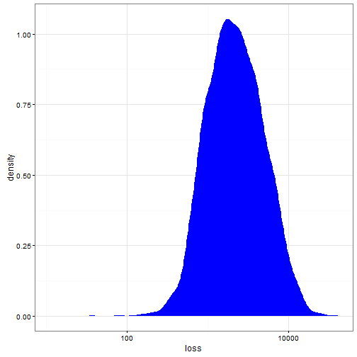
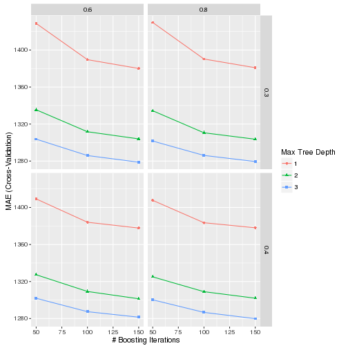

---

# Preamble

Set working directory.


```r
setwd("~/Projects/Kaggle/AllstateClaimsSeverity/scripts")
```

Load libraries.


Reproducibility steps.


```r
sessionInfo()
```

```
## R version 3.3.1 (2016-06-21)
## Platform: x86_64-w64-mingw32/x64 (64-bit)
## Running under: Windows 7 x64 (build 7601) Service Pack 1
## 
## locale:
## [1] LC_COLLATE=English_United States.1252 
## [2] LC_CTYPE=English_United States.1252   
## [3] LC_MONETARY=English_United States.1252
## [4] LC_NUMERIC=C                          
## [5] LC_TIME=English_United States.1252    
## 
## attached base packages:
## [1] parallel  stats     graphics  grDevices utils     datasets  methods  
## [8] base     
## 
## other attached packages:
##  [1] doParallel_1.0.10   iterators_1.0.8     foreach_1.4.3      
##  [4] reshape2_1.4.1      dplyr_0.5.0         plyr_1.8.4         
##  [7] rmarkdown_1.0       knitr_1.14          xgboost_0.4-4      
## [10] caret_6.0-71        ggplot2_2.1.0       lattice_0.20-33    
## [13] Matrix_1.2-6        checkpoint_0.3.16   RevoUtilsMath_8.0.3
## 
## loaded via a namespace (and not attached):
##  [1] Rcpp_0.12.6        compiler_3.3.1     nloptr_1.0.4      
##  [4] formatR_1.4        tools_3.3.1        digest_0.6.10     
##  [7] lme4_1.1-12        tibble_1.2         evaluate_0.9      
## [10] nlme_3.1-128       gtable_0.2.0       mgcv_1.8-12       
## [13] DBI_0.5-1          SparseM_1.7        stringr_1.0.0     
## [16] RevoUtils_10.0.1   MatrixModels_0.4-1 stats4_3.3.1      
## [19] grid_3.3.1         nnet_7.3-12        data.table_1.9.6  
## [22] R6_2.2.0           minqa_1.2.4        car_2.1-3         
## [25] magrittr_1.5       htmltools_0.3.5    scales_0.4.0      
## [28] codetools_0.2-14   MASS_7.3-45        splines_3.3.1     
## [31] assertthat_0.1     pbkrtest_0.4-6     colorspace_1.2-6  
## [34] labeling_0.3       quantreg_5.26      stringi_1.1.1     
## [37] lazyeval_0.2.0     munsell_0.4.3      chron_2.3-47
```

```r
set.seed(as.integer(as.Date("2016-10-10")))
```

Source user-defined functions.


```r
sapply(list.files("../lib", full.names = TRUE), source)
```

```
##         ../lib/mae.R ../lib/summaryMAE.R
## value   ?            ?                  
## visible FALSE        FALSE
```

---

# Read data

Read the training data.

Using `download.file` and `unzip` returns an error message:


```r
url <- "https://www.kaggle.com/c/allstate-claims-severity/download/train.csv.zip"
f <- tempfile()
download.file(url, f, mode = "wb")
unzip(f, list = TRUE)
```

```
Error in unzip(f, list = TRUE) : 
  zip file 'C:\Users\chanb\AppData\Local\Temp\1\Rtmpohg9qM\filedb017386a2d' cannot be opened
```

So I'll workaround by saving the zip files manually to `../data/raw` and `unzip`ing from there.


```r
unzip("../data/raw/train.csv.zip", exdir = tempdir())
train <- read.csv(file.path(tempdir(), "train.csv"), stringsAsFactors = TRUE)
unzip("../data/raw/test.csv.zip", exdir = tempdir())
test <- read.csv(file.path(tempdir(), "test.csv"), stringsAsFactors = TRUE)
```

List the columns in both data sets.


```r
merge(data.frame(col = names(train), inTrain = TRUE),
      data.frame(col = names(test), inTest = TRUE),
      by = "col", all = TRUE) %>%
  filter(inTrain & inTest) %>%
  .[, "col"]
```

```
##   [1] cat1   cat10  cat100 cat101 cat102 cat103 cat104 cat105 cat106 cat107
##  [11] cat108 cat109 cat11  cat110 cat111 cat112 cat113 cat114 cat115 cat116
##  [21] cat12  cat13  cat14  cat15  cat16  cat17  cat18  cat19  cat2   cat20 
##  [31] cat21  cat22  cat23  cat24  cat25  cat26  cat27  cat28  cat29  cat3  
##  [41] cat30  cat31  cat32  cat33  cat34  cat35  cat36  cat37  cat38  cat39 
##  [51] cat4   cat40  cat41  cat42  cat43  cat44  cat45  cat46  cat47  cat48 
##  [61] cat49  cat5   cat50  cat51  cat52  cat53  cat54  cat55  cat56  cat57 
##  [71] cat58  cat59  cat6   cat60  cat61  cat62  cat63  cat64  cat65  cat66 
##  [81] cat67  cat68  cat69  cat7   cat70  cat71  cat72  cat73  cat74  cat75 
##  [91] cat76  cat77  cat78  cat79  cat8   cat80  cat81  cat82  cat83  cat84 
## [101] cat85  cat86  cat87  cat88  cat89  cat9   cat90  cat91  cat92  cat93 
## [111] cat94  cat95  cat96  cat97  cat98  cat99  cont1  cont10 cont11 cont12
## [121] cont13 cont14 cont2  cont3  cont4  cont5  cont6  cont7  cont8  cont9 
## [131] id    
## 132 Levels: cat1 cat10 cat100 cat101 cat102 cat103 cat104 cat105 ... loss
```

Check that the columns in `train` are the same as in `test`.
Show the columns that are not in both data sets.


```r
merge(data.frame(col = names(train), inTrain = TRUE),
      data.frame(col = names(test), inTest = TRUE),
      by = "col", all = TRUE) %>%
  filter(is.na(inTrain) | is.na(inTest))
```

```
##    col inTrain inTest
## 1 loss    TRUE     NA
```

---

# Explore sample

Take a sample of the `train` data for exploration.


```r
sample <- filter(train, id %in% sample(train$id, length(train$id) * 0.05))
nrow(sample)
```

```
## [1] 9415
```

Plot the density of the `loss` variable.


```r
summary(sample$loss)
```

```
##    Min. 1st Qu.  Median    Mean 3rd Qu.    Max. 
##      11    1226    2138    3036    3903   41150
```

```r
ggplot(sample, aes(x = loss)) +
  geom_density(color = NA, fill = "blue") +
  scale_x_log10() +
  theme_bw()
```




## Continuous predictors

Plot bivariate densities between `loss` and the `cont` variables.
Look for patterns or clusterings with `loss`.


```r
select(sample, matches("loss|cont")) %>%
  melt(id.vars = c("loss")) %>%
  ggplot(aes(x = value, y = loss, group = variable)) +
    scale_y_log10() +
    stat_density_2d(aes(fill = ..level..), geom = "polygon") +
    scale_fill_gradient("density", low = "blue", high = "white") +
    facet_wrap(~ variable) +
    theme_bw()
```


Show summary statistics for `cont` variables.


```r
select(sample, matches("cont")) %>% summary()
```

```
##      cont1              cont2              cont3              cont4       
##  Min.   :0.000016   Min.   :0.001503   Min.   :0.002634   Min.   :0.1769  
##  1st Qu.:0.344779   1st Qu.:0.358319   1st Qu.:0.336963   1st Qu.:0.3184  
##  Median :0.475784   Median :0.555782   Median :0.527991   Median :0.4529  
##  Mean   :0.491986   Mean   :0.505485   Mean   :0.499569   Mean   :0.4873  
##  3rd Qu.:0.614340   3rd Qu.:0.681761   3rd Qu.:0.634224   3rd Qu.:0.6333  
##  Max.   :0.977873   Max.   :0.862654   Max.   :0.944251   Max.   :0.9525  
##      cont5            cont6             cont7            cont8       
##  Min.   :0.2811   Min.   :0.01268   Min.   :0.0695   Min.   :0.2369  
##  1st Qu.:0.2811   1st Qu.:0.33506   1st Qu.:0.3502   1st Qu.:0.3180  
##  Median :0.4223   Median :0.43863   Median :0.4357   Median :0.4352  
##  Mean   :0.4882   Mean   :0.48810   Mean   :0.4828   Mean   :0.4846  
##  3rd Qu.:0.6433   3rd Qu.:0.64862   3rd Qu.:0.5895   3rd Qu.:0.6123  
##  Max.   :0.9813   Max.   :0.98902   Max.   :1.0000   Max.   :0.9802  
##      cont9             cont10           cont11            cont12       
##  Min.   :0.00008   Min.   :0.0000   Min.   :0.03532   Min.   :0.03623  
##  1st Qu.:0.35897   1st Qu.:0.3646   1st Qu.:0.30763   1st Qu.:0.30839  
##  Median :0.43318   Median :0.4557   Median :0.45720   Median :0.46229  
##  Mean   :0.48393   Mean   :0.4956   Mean   :0.49070   Mean   :0.49051  
##  3rd Qu.:0.55855   3rd Qu.:0.6146   3rd Qu.:0.67209   3rd Qu.:0.66903  
##  Max.   :0.99133   Max.   :0.9948   Max.   :0.99535   Max.   :0.99455  
##      cont13             cont14      
##  Min.   :0.000228   Min.   :0.1808  
##  1st Qu.:0.315758   1st Qu.:0.2953  
##  Median :0.363547   Median :0.4006  
##  Mean   :0.491356   Mean   :0.4963  
##  3rd Qu.:0.687115   3rd Qu.:0.7249  
##  Max.   :0.948826   Max.   :0.8447
```

Show the standard deviations of the `cont` variables.


```r
select(sample, matches("cont")) %>% var() %>% diag() %>% sqrt()
```

```
##     cont1     cont2     cont3     cont4     cont5     cont6     cont7 
## 0.1871571 0.2064213 0.2015206 0.2109135 0.2106000 0.2032874 0.1774642 
##     cont8     cont9    cont10    cont11    cont12    cont13    cont14 
## 0.1962737 0.1817104 0.1842177 0.2079167 0.2073189 0.2112968 0.2227996
```

The `cont` variables are pre-scaled with values between 0, 0.999998.
Therefore, no preprocessing is needed.

Plot bivariate densities between `cont` variables.
Look for correlations to reduce dimensionality of data.


```r
corr <-
  select(sample, matches("cont")) %>%
  cor()
contHighCorr <- colnames(corr)[findCorrelation(corr)]
sprintf("Remove variable due to high pair-wise correlation with other variables: %s",
        contHighCorr)
```

```
## [1] "Remove variable due to high pair-wise correlation with other variables: cont9" 
## [2] "Remove variable due to high pair-wise correlation with other variables: cont12"
```

```r
replace(corr, which(upper.tri(corr, diag = TRUE)), NA) %>%
  melt(na.rm = TRUE) %>%
  ggplot(aes(x = Var1, y = Var2, fill = value)) + 
    geom_tile(color = "white") +
    scale_fill_gradient2(low = "blue",
                         high = "red",
                         mid = "white",
                         midpoint = 0,
                         limit = c(-1, 1),
                         space = "Lab",
                         name="R") +
    theme_minimal() +
    theme(axis.text.x = element_text(angle = 45, vjust = 1, hjust = 1),
          axis.title.x = element_blank(),
          axis.title.y = element_blank(),
          panel.grid.major = element_blank()) +
    coord_fixed()
```


```r
round(corr, 2)
```

```
##        cont1 cont2 cont3 cont4 cont5 cont6 cont7 cont8 cont9 cont10 cont11
## cont1   1.00 -0.08 -0.44  0.36 -0.02  0.76  0.37  0.36  0.93   0.81   0.60
## cont2  -0.08  1.00  0.44  0.06  0.20  0.01  0.03  0.14 -0.02   0.07   0.11
## cont3  -0.44  0.44  1.00 -0.33  0.09 -0.36  0.10 -0.19 -0.42  -0.32   0.02
## cont4   0.36  0.06 -0.33  1.00  0.17  0.21 -0.12  0.54  0.32   0.27   0.11
## cont5  -0.02  0.20  0.09  0.17  1.00 -0.15 -0.26  0.02 -0.08  -0.06  -0.15
## cont6   0.76  0.01 -0.36  0.21 -0.15  1.00  0.65  0.42  0.80   0.88   0.77
## cont7   0.37  0.03  0.10 -0.12 -0.26  0.65  1.00  0.12  0.38   0.49   0.75
## cont8   0.36  0.14 -0.19  0.54  0.02  0.42  0.12  1.00  0.45   0.33   0.29
## cont9   0.93 -0.02 -0.42  0.32 -0.08  0.80  0.38  0.45  1.00   0.78   0.61
## cont10  0.81  0.07 -0.32  0.27 -0.06  0.88  0.49  0.33  0.78   1.00   0.70
## cont11  0.60  0.11  0.02  0.11 -0.15  0.77  0.75  0.29  0.61   0.70   1.00
## cont12  0.62  0.10  0.00  0.12 -0.15  0.78  0.75  0.30  0.62   0.71   0.99
## cont13  0.53  0.02 -0.43  0.17 -0.08  0.81  0.28  0.47  0.63   0.70   0.46
## cont14  0.05 -0.03 -0.03  0.00 -0.02  0.04  0.02  0.04  0.08   0.04   0.04
##        cont12 cont13 cont14
## cont1    0.62   0.53   0.05
## cont2    0.10   0.02  -0.03
## cont3    0.00  -0.43  -0.03
## cont4    0.12   0.17   0.00
## cont5   -0.15  -0.08  -0.02
## cont6    0.78   0.81   0.04
## cont7    0.75   0.28   0.02
## cont8    0.30   0.47   0.04
## cont9    0.62   0.63   0.08
## cont10   0.71   0.70   0.04
## cont11   0.99   0.46   0.04
## cont12   1.00   0.47   0.04
## cont13   0.47   1.00   0.05
## cont14   0.04   0.05   1.00
```

**Summary**

It is obvious that there is not a near-zero variance issue with the continuous predictors.

But there is a opportunity to reduce the dimensionality of the continuous predictors.
Out of the
14 continuous variables,
we can reduce the dimensionality by
14%
by eliminating highly correlated variables.


## Categorical predictors

Plot violin plots for `loss` and the `cat` variables.
*This isn't going to work well; there are too many possible values.*


```r
select(sample, matches("cat")) %>%
  melt(id.vars = NULL) %>%
  select(matches("value")) %>%
  unique() %>%
  nrow()
```

```
## Warning: attributes are not identical across measure variables; they will
## be dropped
```

```
## [1] 271
```

Check for near-zero variance among the `cat` variables.
Exclude these near-zero variances; they likely will not contribute much to prediction.
*May revisit later.*


```r
nearZero <- 
  select(sample, matches("cat")) %>%
  nearZeroVar(saveMetrics = TRUE) %>%
  transform(rowname = rownames(.)) %>%
  filter(zeroVar | nzv)
nearZero
```

```
##     freqRatio percentUnique zeroVar  nzv rowname
## 1    42.79070    0.02124270   FALSE TRUE    cat7
## 2    87.82075    0.02124270   FALSE TRUE   cat14
## 3  4706.50000    0.02124270   FALSE TRUE   cat15
## 4    27.61702    0.02124270   FALSE TRUE   cat16
## 5   116.68750    0.02124270   FALSE TRUE   cat17
## 6   158.57627    0.02124270   FALSE TRUE   cat18
## 7    99.15957    0.02124270   FALSE TRUE   cat19
## 8   940.50000    0.02124270   FALSE TRUE   cat20
## 9   408.34783    0.02124270   FALSE TRUE   cat21
## 10 9414.00000    0.02124270   FALSE TRUE   cat22
## 11   27.53030    0.02124270   FALSE TRUE   cat24
## 12   23.64660    0.02124270   FALSE TRUE   cat28
## 13   49.07979    0.02124270   FALSE TRUE   cat29
## 14   54.05848    0.02124270   FALSE TRUE   cat30
## 15   32.62500    0.02124270   FALSE TRUE   cat31
## 16  153.34426    0.02124270   FALSE TRUE   cat32
## 17  187.30000    0.02124270   FALSE TRUE   cat33
## 18  391.29167    0.02124270   FALSE TRUE   cat34
## 19 1175.87500    0.02124270   FALSE TRUE   cat35
## 20   34.79848    0.02124270   FALSE TRUE   cat39
## 21   20.74365    0.02124270   FALSE TRUE   cat40
## 22   24.65395    0.02124270   FALSE TRUE   cat41
## 23  108.47674    0.02124270   FALSE TRUE   cat42
## 24   41.21973    0.02124270   FALSE TRUE   cat43
## 25   40.11354    0.02124270   FALSE TRUE   cat45
## 26  212.97727    0.02124270   FALSE TRUE   cat46
## 27  275.91176    0.02124270   FALSE TRUE   cat47
## 28  587.43750    0.02124270   FALSE TRUE   cat48
## 29   20.01562    0.02124270   FALSE TRUE   cat49
## 30  150.85484    0.02124270   FALSE TRUE   cat51
## 31   21.10094    0.02124270   FALSE TRUE   cat52
## 32   43.83333    0.02124270   FALSE TRUE   cat54
## 33  783.58333    0.02124270   FALSE TRUE   cat55
## 34  940.50000    0.02124270   FALSE TRUE   cat56
## 35   67.22464    0.02124270   FALSE TRUE   cat57
## 36 1045.11111    0.02124270   FALSE TRUE   cat58
## 37  522.05556    0.02124270   FALSE TRUE   cat59
## 38  494.52632    0.02124270   FALSE TRUE   cat60
## 39  260.52778    0.02124270   FALSE TRUE   cat61
## 40 3137.33333    0.02124270   FALSE TRUE   cat62
## 41 1568.16667    0.02124270   FALSE TRUE   cat63
## 42 1882.00000    0.02124270   FALSE TRUE   cat64
## 43   79.47009    0.02124270   FALSE TRUE   cat65
## 44   22.01956    0.02124270   FALSE TRUE   cat66
## 45  228.63415    0.02124270   FALSE TRUE   cat67
## 46  940.50000    0.02124270   FALSE TRUE   cat68
## 47  552.82353    0.02124270   FALSE TRUE   cat69
## 48 9414.00000    0.02124270   FALSE TRUE   cat70
## 49   19.42299    0.02124270   FALSE TRUE   cat71
## 50   53.09770    0.03186405   FALSE TRUE   cat74
## 51   29.72787    0.03186405   FALSE TRUE   cat76
## 52  425.90909    0.04248540   FALSE TRUE   cat77
## 53  217.02326    0.04248540   FALSE TRUE   cat78
## 54  193.70833    0.04248540   FALSE TRUE   cat85
## 55   45.77114    0.04248540   FALSE TRUE   cat89
## 56   22.49485    0.07434944   FALSE TRUE   cat96
## 57   33.83206    0.06372809   FALSE TRUE  cat102
```

Check how many unique values are in the remaining non-near-zero variance `cat` variables.
*There are still too many possible values.*


```r
select(sample, -matches(paste(c(as.character(nearZero$rowname), "cont", "id", "loss"), collapse = "|"))) %>%
  melt(id.vars = NULL) %>%
  select(matches("value")) %>%
  unique() %>%
  nrow()
```

```
## Warning: attributes are not identical across measure variables; they will
## be dropped
```

```
## [1] 271
```

Find linear combinations of the remaining non-near-zero variance `cat` variables.


```r
sampleSubset <-
  select(sample, -matches(paste(nearZero$rowname, collapse = "|"))) %>%
  select(matches("cat"))
fx <-
  names(sampleSubset) %>%
  paste(collapse = " + ") %>%
  paste("~ ", .) %>%
  formula()
catDummies <- 
  dummyVars(fx, data = sampleSubset, sep = "_") %>%
  predict(newdata = sampleSubset)
linCom <-
  as.matrix(catDummies) %>%
  findLinearCombos()
catDummiesLinCom <-
  data.frame(catDummies) %>%
  names() %>%
  .[linCom$remove]
```

**Summary**

There is a opportunity to reduce the dimensionality of the categorical predictors by eliminating near-zero variance predictors.
Out of the
116 categorical variables,
we can reduce the dimensionality by
49%
by eliminating near-zero variance variables.

We can reduce dimensionality further.
Out of the
986 non-near-zero variance categorical dummy indicator variables,
we can reduce the dimensionality by
34%
by eliminating linear combinations.

---

# Preprocess

Take a sample of the `train` and `test` data for testing.


```r
train <- filter(train, id %in% sample(train$id, length(train$id) * 0.05))
test <- filter(test, id %in% sample(test$id, length(test$id) * 0.05))
dim(train)
```

```
## [1] 9415  132
```

```r
dim(test)
```

```
## [1] 6277  131
```

Preprocess the `train` and `test` data in parallel.


```r
cl <- makeCluster(2)
registerDoParallel(cl)
```

Preprocessing steps

1. Remove highly correlated continuous predictors
2. Remove near-zero variance categorical predictors
3. Create dummy indicator variables for remaining categorical predictors
4. Remove dummy indicator variables corresponding to linear combinations


```r
L1 <- list(train, test)
L2 <- foreach (i = 1:length(L1)) %dopar% {
  library(magrittr)
  library(dplyr)
  library(caret)
  select(L1[[i]], -matches(paste(contHighCorr, collapse = "|"))) %>%
    select(-matches(paste(nearZero$rowname, collapse = "|"))) %>%
    names() %>%
    paste(collapse = " + ") %>%
    paste("~ ", .) %>%
    formula() %>%
    dummyVars(data = L1[[i]], sep = "_") %>%
    predict(newdata = L1[[i]]) %>%
    data.frame() %>%
    select(-matches(paste(catDummiesLinCom, collapse = "|")))
}
train <- L2[[1]]
test <- L2[[2]]
```

Stop the clusters.


```r
stopCluster(cl)
```

Check that the columns in `train` are the same as in `test`.
Show the columns that are not in both data sets.
*These are predictor values that are not in both data sets.*


```r
uncommon <-
  merge(data.frame(col = names(train), inTrain = TRUE),
        data.frame(col = names(test), inTest = TRUE),
        by = "col", all = TRUE) %>%
  filter((is.na(inTrain) | is.na(inTest)) & col != "loss")
uncommon
```

```
##          col inTrain inTest
## 1  cat109_CJ    TRUE     NA
## 2  cat110_AN    TRUE     NA
## 3   cat110_H    TRUE     NA
## 4   cat103_M      NA   TRUE
## 5   cat106_Q      NA   TRUE
## 6  cat109_AD      NA   TRUE
## 7  cat110_BH      NA   TRUE
## 8  cat110_CA      NA   TRUE
## 9  cat110_EN      NA   TRUE
## 10  cat111_L      NA   TRUE
## 11 cat113_AA      NA   TRUE
## 12  cat113_R      NA   TRUE
## 13  cat116_A      NA   TRUE
## 14 cat116_AI      NA   TRUE
## 15 cat116_AQ      NA   TRUE
## 16 cat116_BE      NA   TRUE
## 17 cat116_BH      NA   TRUE
## 18 cat116_BJ      NA   TRUE
## 19 cat116_BN      NA   TRUE
## 20 cat116_BR      NA   TRUE
## 21 cat116_EM      NA   TRUE
## 22 cat116_ER      NA   TRUE
## 23 cat116_ET      NA   TRUE
## 24 cat116_EX      NA   TRUE
## 25  cat116_N      NA   TRUE
## 26   cat92_E      NA   TRUE
## 27   cat92_G      NA   TRUE
## 28   cat99_U      NA   TRUE
```

Remove these predictors from both data sets.


```r
train <- select(train, -matches(paste(uncommon$col, collapse = "|")))
test <- select(test, -matches(paste(uncommon$col, collapse = "|")))
dim(train)
```

```
## [1] 9415  474
```

```r
dim(test)
```

```
## [1] 6277  473
```

---

# Model on `train`

Set the control parameters.
Use the mean absolute error as the prediction metric.


```r
ctrl <- trainControl(method = "cv",
                     number = 10,
                     savePredictions = TRUE,
                     allowParallel = FALSE,
                     # allowParallel = TRUE,
                     summaryFunction = summaryMAE)
```

Set the model.


```r
# method <- "xgbLinear"
method <- "xgbTree"
```

Set the tuning grid for model xgbTree.


```r
# grid <- expand.grid(interaction.depth = 3:5,
#                     n.trees = seq(50, 150, 50),
#                     shrinkage = 0.1,
#                     n.minobsinnode = 10)
```

Fit model over the tuning parameters.


```r
# cl <- makeCluster(10)
# registerDoParallel(cl)
trainingModel <- train(loss ~ .,
                       data = train,
                       method = method,
                       # trControl = ctrl)
                       trControl = ctrl,
                       # tuneGrid = grid,
                       metric = "MAE",
                       maximize = FALSE)
# stopCluster(cl)
```

Evaluate the model on the training dataset.


```r
trainingModel
```

```
## eXtreme Gradient Boosting 
## 
## 9415 samples
##  473 predictor
## 
## No pre-processing
## Resampling: Cross-Validated (10 fold) 
## Summary of sample sizes: 8472, 8474, 8474, 8472, 8474, 8473, ... 
## Resampling results across tuning parameters:
## 
##   eta  max_depth  colsample_bytree  nrounds  MAE     
##   0.3  1          0.6                50      1418.957
##   0.3  1          0.6               100      1383.061
##   0.3  1          0.6               150      1377.242
##   0.3  1          0.8                50      1421.552
##   0.3  1          0.8               100      1383.801
##   0.3  1          0.8               150      1377.957
##   0.3  2          0.6                50      1346.394
##   0.3  2          0.6               100      1336.517
##   0.3  2          0.6               150      1338.590
##   0.3  2          0.8                50      1338.820
##   0.3  2          0.8               100      1327.926
##   0.3  2          0.8               150      1329.432
##   0.3  3          0.6                50      1328.557
##   0.3  3          0.6               100      1330.080
##   0.3  3          0.6               150      1336.069
##   0.3  3          0.8                50      1331.973
##   0.3  3          0.8               100      1329.940
##   0.3  3          0.8               150      1338.229
##   0.4  1          0.6                50      1396.040
##   0.4  1          0.6               100      1379.413
##   0.4  1          0.6               150      1377.518
##   0.4  1          0.8                50      1397.789
##   0.4  1          0.8               100      1378.897
##   0.4  1          0.8               150      1378.096
##   0.4  2          0.6                50      1343.421
##   0.4  2          0.6               100      1342.048
##   0.4  2          0.6               150      1344.982
##   0.4  2          0.8                50      1339.649
##   0.4  2          0.8               100      1339.996
##   0.4  2          0.8               150      1342.589
##   0.4  3          0.6                50      1350.495
##   0.4  3          0.6               100      1357.938
##   0.4  3          0.6               150      1367.866
##   0.4  3          0.8                50      1341.473
##   0.4  3          0.8               100      1353.310
##   0.4  3          0.8               150      1365.161
## 
## Tuning parameter 'gamma' was held constant at a value of 0
## 
## Tuning parameter 'min_child_weight' was held constant at a value of 1
## MAE was used to select the optimal model using  the smallest value.
## The final values used for the model were nrounds = 100, max_depth = 2,
##  eta = 0.3, gamma = 0, colsample_bytree = 0.8 and min_child_weight = 1.
```

```r
ggplot(trainingModel)
```




```r
hat <-
  train %>%
  transform(hat = predict(trainingModel, train)) %>%
  select(matches("loss|hat"))
cor(hat[, c("loss", "hat")])
```

```
##           loss       hat
## loss 1.0000000 0.7401896
## hat  0.7401896 1.0000000
```

```r
postResample(hat$hat, hat$loss)
```

```
##         RMSE     Rsquared 
## 1903.1092483    0.5478806
```

```r
mae(hat$hat, hat$loss)
```

```
## [1] 1254.571
```

```r
ggplot(hat, aes(x = loss, y = hat)) +
  scale_x_log10() +
  scale_y_log10() +
  stat_density_2d(aes(fill = ..level..), geom = "polygon") +
  scale_fill_gradient("density", low = "blue", high = "white") +
  geom_abline(intercept = 0, slope = 1) +
  labs(title = sprintf("R-square = %g, RMSE = %g, MAE = %g",
                       R2(hat$hat, hat$loss),
                       RMSE(hat$hat, hat$loss),
                       mae(hat$hat, hat$loss))) +
  theme_bw()
```


Display the final model.


```r
varImp(trainingModel)
```

```
## xgbTree variable importance
## 
##   only 20 most important variables shown (out of 104)
## 
##          Overall
## cat80_B  100.000
## cat87_B   32.352
## cont7     25.326
## cat12_A   20.654
## cont2     20.404
## cat81_B    8.640
## cont11     7.400
## cat5_A     4.884
## cat53_A    4.576
## cat11_A    4.408
## cat13_A    3.924
## cat113_E   3.660
## cat1_B     3.578
## cont14     3.557
## cat100_G   3.491
## cat10_A    3.081
## cat26_A    2.982
## cat1_A     2.940
## cat38_A    2.635
## cat100_I   2.540
```

```r
trainingModel$finalModel
```

```
## $handle
## <pointer: 0x000000000271cbc0>
## attr(,"class")
## [1] "xgb.Booster.handle"
## 
## $raw
##    [1] 00 00 00 3f d9 01 00 00 00 00 00 00 00 00 00 00 00 00 00 00 00 00 00
##   [24] 00 00 00 00 00 00 00 00 00 00 00 00 00 00 00 00 00 00 00 00 00 00 00
##   [47] 00 00 00 00 00 00 00 00 00 00 00 00 00 00 00 00 00 00 00 00 00 00 00
##   [70] 00 00 00 00 00 00 00 00 00 00 00 00 00 00 00 00 00 00 00 00 00 00 00
##   [93] 00 00 00 00 00 00 00 00 00 00 00 00 00 00 00 00 00 00 00 00 00 00 00
##  [116] 00 00 00 00 00 00 00 00 00 00 00 00 00 00 00 00 00 00 00 00 00 0a 00
##  [139] 00 00 00 00 00 00 72 65 67 3a 6c 69 6e 65 61 72 06 00 00 00 00 00 00
##  [162] 00 67 62 74 72 65 65 64 00 00 00 00 00 00 00 d9 01 00 00 00 00 00 00
##  [185] 00 00 00 00 00 00 00 00 01 00 00 00 00 00 00 00 00 00 00 00 00 00 00
##  [208] 00 00 00 00 00 00 00 00 00 00 00 00 00 00 00 00 00 00 00 00 00 00 00
##  [231] 00 00 00 00 00 00 00 00 00 00 00 00 00 00 00 00 00 00 00 00 00 00 00
##  [254] 00 00 00 00 00 00 00 00 00 00 00 00 00 00 00 00 00 00 00 00 00 00 00
##  [277] 00 00 00 00 00 00 00 00 00 00 00 00 00 00 00 00 00 00 00 00 00 00 00
##  [300] 00 00 00 00 00 00 00 00 00 00 00 00 00 00 00 00 00 00 00 00 00 00 00
##  [323] 00 00 00 00 00 00 01 00 00 00 07 00 00 00 00 00 00 00 00 00 00 00 d9
##  [346] 01 00 00 00 00 00 00 00 00 00 00 00 00 00 00 00 00 00 00 00 00 00 00
##  [369] 00 00 00 00 00 00 00 00 00 00 00 00 00 00 00 00 00 00 00 00 00 00 00
##  [392] 00 00 00 00 00 00 00 00 00 00 00 00 00 00 00 00 00 00 00 00 00 00 00
##  [415] 00 00 00 00 00 00 00 00 00 00 00 00 00 00 00 00 00 00 00 00 00 00 00
##  [438] 00 00 00 00 00 00 00 00 00 00 00 00 00 00 00 00 00 00 00 00 00 00 00
##  [461] 00 00 00 00 00 00 00 00 00 00 00 00 00 00 00 00 ff ff ff ff 01 00 00
##  [484] 00 02 00 00 00 29 00 00 80 00 00 28 b7 00 00 00 80 03 00 00 00 04 00
##  [507] 00 00 ce 01 00 80 61 36 e9 3e 00 00 00 00 05 00 00 00 06 00 00 00 0c
##  [530] 00 00 80 00 00 28 b7 01 00 00 80 ff ff ff ff ff ff ff ff 00 00 00 00
##  [553] 31 0c a0 44 01 00 00 00 ff ff ff ff ff ff ff ff 00 00 00 00 28 fe f5
##  [576] 44 02 00 00 80 ff ff ff ff ff ff ff ff 00 00 00 00 f0 17 a2 44 02 00
##  [599] 00 00 ff ff ff ff ff ff ff ff 00 00 00 00 48 e6 37 44 e0 49 fb 4f 00
##  [622] 1c 13 46 3f d2 3b 45 00 00 00 00 dd 54 90 4e 00 40 7e 44 fb e1 b2 45
##  [645] 02 00 00 00 d4 72 37 4f 00 38 03 46 6a 33 27 45 02 00 00 00 00 00 00
##  [668] 00 00 80 ba 43 7e 5f 85 45 00 00 00 00 00 00 00 00 00 00 21 44 76 fe
##  [691] cc 45 00 00 00 00 00 00 00 00 00 00 7a 44 f2 13 87 45 00 00 00 00 00
##  [714] 00 00 00 00 30 e7 45 e6 3f 19 45 00 00 00 00 01 00 00 00 07 00 00 00
##  [737] 00 00 00 00 00 00 00 00 d9 01 00 00 00 00 00 00 00 00 00 00 00 00 00
##  [760] 00 00 00 00 00 00 00 00 00 00 00 00 00 00 00 00 00 00 00 00 00 00 00
##  [783] 00 00 00 00 00 00 00 00 00 00 00 00 00 00 00 00 00 00 00 00 00 00 00
##  [806] 00 00 00 00 00 00 00 00 00 00 00 00 00 00 00 00 00 00 00 00 00 00 00
##  [829] 00 00 00 00 00 00 00 00 00 00 00 00 00 00 00 00 00 00 00 00 00 00 00
##  [852] 00 00 00 00 00 00 00 00 00 00 00 00 00 00 00 00 00 00 00 00 00 00 00
##  [875] 00 00 ff ff ff ff 01 00 00 00 02 00 00 00 19 00 00 80 00 00 28 b7 00
##  [898] 00 00 80 03 00 00 00 04 00 00 00 01 00 00 80 00 00 28 b7 00 00 00 00
##  [921] 05 00 00 00 06 00 00 00 d3 01 00 80 24 7e 5d 3f 01 00 00 80 ff ff ff
##  [944] ff ff ff ff ff 00 00 00 00 36 58 86 43 01 00 00 00 ff ff ff ff ff ff
##  [967] ff ff 00 00 00 00 42 0b f2 43 02 00 00 80 ff ff ff ff ff ff ff ff 00
##  [990] 00 00 00 26 4b 97 44 02 00 00 00
##  [ reached getOption("max.print") -- omitted 39224 entries ]
## 
## $xNames
##   [1] "id"        "cat1_A"    "cat1_B"    "cat2_A"    "cat3_A"   
##   [6] "cat4_A"    "cat5_A"    "cat6_A"    "cat8_A"    "cat9_A"   
##  [11] "cat10_A"   "cat11_A"   "cat12_A"   "cat13_A"   "cat23_A"  
##  [16] "cat25_A"   "cat26_A"   "cat27_A"   "cat36_A"   "cat37_A"  
##  [21] "cat38_A"   "cat44_A"   "cat50_A"   "cat53_A"   "cat80_A"  
##  [26] "cat80_B"   "cat80_C"   "cat81_B"   "cat81_C"   "cat82_A"  
##  [31] "cat82_B"   "cat82_C"   "cat83_A"   "cat83_B"   "cat83_C"  
##  [36] "cat84_A"   "cat84_B"   "cat84_C"   "cat86_A"   "cat86_B"  
##  [41] "cat86_C"   "cat87_B"   "cat87_C"   "cat88_A"   "cat88_D"  
##  [46] "cat90_B"   "cat90_C"   "cat90_D"   "cat90_E"   "cat91_A"  
##  [51] "cat91_B"   "cat91_C"   "cat91_D"   "cat91_E"   "cat91_F"  
##  [56] "cat91_G"   "cat92_A"   "cat92_B"   "cat92_C"   "cat93_A"  
##  [61] "cat93_B"   "cat93_C"   "cat93_D"   "cat94_A"   "cat94_B"  
##  [66] "cat94_C"   "cat94_D"   "cat94_E"   "cat95_A"   "cat95_B"  
##  [71] "cat95_C"   "cat95_D"   "cat97_A"   "cat97_B"   "cat97_C"  
##  [76] "cat97_D"   "cat97_E"   "cat97_F"   "cat98_A"   "cat98_B"  
##  [81] "cat98_C"   "cat99_C"   "cat99_D"   "cat99_E"   "cat99_H"  
##  [86] "cat99_I"   "cat99_K"   "cat99_N"   "cat99_P"   "cat100_A" 
##  [91] "cat100_B"  "cat100_C"  "cat100_D"  "cat100_F"  "cat100_G" 
##  [96] "cat100_H"  "cat100_I"  "cat100_J"  "cat100_K"  "cat100_L" 
## [101] "cat100_M"  "cat100_N"  "cat101_C"  "cat101_D"  "cat101_F" 
## [106] "cat101_G"  "cat101_I"  "cat101_J"  "cat101_L"  "cat101_M" 
## [111] "cat101_O"  "cat101_Q"  "cat101_R"  "cat103_B"  "cat103_C" 
## [116] "cat103_D"  "cat103_E"  "cat103_F"  "cat103_G"  "cat103_H" 
## [121] "cat103_I"  "cat103_J"  "cat104_A"  "cat104_C"  "cat104_D" 
## [126] "cat104_E"  "cat104_F"  "cat104_G"  "cat104_H"  "cat104_I" 
## [131] "cat104_J"  "cat104_K"  "cat104_L"  "cat104_M"  "cat104_N" 
## [136] "cat104_O"  "cat105_A"  "cat105_B"  "cat105_C"  "cat105_D" 
## [141] "cat105_E"  "cat105_F"  "cat105_G"  "cat105_H"  "cat105_I" 
## [146] "cat105_J"  "cat105_K"  "cat105_L"  "cat105_M"  "cat105_N" 
## [151] "cat106_C"  "cat106_D"  "cat106_E"  "cat106_F"  "cat106_G" 
## [156] "cat106_H"  "cat106_I"  "cat106_J"  "cat106_K"  "cat106_L" 
## [161] "cat106_M"  "cat106_N"  "cat107_C"  "cat107_D"  "cat107_E" 
## [166] "cat107_F"  "cat107_G"  "cat107_H"  "cat107_I"  "cat107_J" 
## [171] "cat107_K"  "cat107_L"  "cat107_M"  "cat107_N"  "cat107_O" 
## [176] "cat107_P"  "cat108_A"  "cat108_B"  "cat108_C"  "cat108_D" 
## [181] "cat108_E"  "cat108_H"  "cat108_I"  "cat109_A"  "cat109_AB"
## [186] "cat109_AE" "cat109_AH" "cat109_AI" "cat109_AJ" "cat109_AL"
## [191] "cat109_AM" "cat109_AN" "cat109_AQ" "cat109_AR" "cat109_AS"
## [196] "cat109_AT" "cat109_AU" "cat109_AW" "cat109_AX" "cat109_AY"
## [201] "cat109_C"  "cat109_CA" "cat109_CC" "cat109_CD" "cat109_CI"
## [206] "cat109_CK" "cat109_CL" "cat109_D"  "cat109_F"  "cat109_G" 
## [211] "cat109_H"  "cat109_I"  "cat109_K"  "cat109_L"  "cat109_M" 
## [216] "cat109_N"  "cat109_O"  "cat109_Q"  "cat109_R"  "cat109_S" 
## [221] "cat109_T"  "cat109_U"  "cat110_A"  "cat110_AA" "cat110_AB"
## [226] "cat110_AC" "cat110_AD" "cat110_AE" "cat110_AH" "cat110_AI"
## [231] "cat110_AJ" "cat110_AK" "cat110_AL" "cat110_AM" "cat110_AP"
## [236] "cat110_AR" "cat110_AT" "cat110_AU" "cat110_AW" "cat110_AX"
## [241] "cat110_AY" "cat110_B"  "cat110_BA" "cat110_BC" "cat110_BE"
## [246] "cat110_BF" "cat110_BG" "cat110_BO" "cat110_BP" "cat110_BQ"
## [251] "cat110_BR" "cat110_BS" "cat110_BT" "cat110_BW" "cat110_BY"
## [256] "cat110_C"  "cat110_CF" "cat110_CG" "cat110_CH" "cat110_CI"
## [261] "cat110_CJ" "cat110_CK" "cat110_CL" "cat110_CM" "cat110_CN"
## [266] "cat110_CO" "cat110_CP" "cat110_CQ" "cat110_CR" "cat110_CS"
## [271] "cat110_CU" "cat110_CV" "cat110_CX" "cat110_D"  "cat110_DA"
## [276] "cat110_DB" "cat110_DC" "cat110_DD" "cat110_DE" "cat110_DF"
## [281] "cat110_DH" "cat110_DI" "cat110_DJ" "cat110_DK" "cat110_DL"
## [286] "cat110_DM" "cat110_DO" "cat110_DP" "cat110_DR" "cat110_DS"
## [291] "cat110_DU" "cat110_DW" "cat110_DX" "cat110_E"  "cat110_EA"
## [296] "cat110_EB" "cat110_ED" "cat110_EE" "cat110_EF" "cat110_EG"
## [301] "cat110_EL" "cat110_G"  "cat110_I"  "cat110_J"  "cat110_K" 
## [306] "cat110_L"  "cat110_N"  "cat110_O"  "cat110_P"  "cat110_R" 
## [311] "cat110_T"  "cat110_U"  "cat110_V"  "cat110_W"  "cat110_X" 
## [316] "cat111_C"  "cat111_E"  "cat111_G"  "cat111_I"  "cat111_K" 
## [321] "cat111_M"  "cat111_O"  "cat111_Q"  "cat111_S"  "cat112_A" 
## [326] "cat112_AA" "cat112_AB" "cat112_AC" "cat112_AD" "cat112_AE"
## [331] "cat112_AF" "cat112_AG" "cat112_AH" "cat112_AI" "cat112_AJ"
## [336] "cat112_AK" "cat112_AL" "cat112_AM" "cat112_AN" "cat112_AO"
## [341] "cat112_AP" "cat112_AR" "cat112_AS" "cat112_AT" "cat112_AU"
## [346] "cat112_AV" "cat112_AW" "cat112_AX" "cat112_AY" "cat112_B" 
## [351] "cat112_BA" "cat112_C"  "cat112_D"  "cat112_E"  "cat112_F" 
## [356] "cat112_G"  "cat112_H"  "cat112_I"  "cat112_J"  "cat112_K" 
## [361] "cat112_L"  "cat112_M"  "cat112_N"  "cat112_O"  "cat112_P" 
## [366] "cat112_Q"  "cat112_R"  "cat112_S"  "cat112_T"  "cat112_U" 
## [371] "cat112_V"  "cat112_W"  "cat112_X"  "cat113_A"  "cat113_AB"
## [376] "cat113_AD" "cat113_AE" "cat113_AF" "cat113_AG" "cat113_AH"
## [381] "cat113_AI" "cat113_AJ" "cat113_AK" "cat113_AM" "cat113_AN"
## [386] "cat113_AO" "cat113_AP" "cat113_AS" "cat113_AT" "cat113_AU"
## [391] "cat113_AV" "cat113_AW" "cat113_AX" "cat113_AY" "cat113_C" 
## [396] "cat113_E"  "cat113_F"  "cat113_G"  "cat113_H"  "cat113_I" 
## [401] "cat113_J"  "cat113_K"  "cat113_L"  "cat113_M"  "cat113_N" 
## [406] "cat113_Q"  "cat113_S"  "cat113_U"  "cat113_X"  "cat114_C" 
## [411] "cat114_E"  "cat114_F"  "cat114_I"  "cat114_J"  "cat114_L" 
## [416] "cat114_N"  "cat114_O"  "cat114_Q"  "cat114_R"  "cat114_U" 
## [421] "cat114_V"  "cat115_F"  "cat115_G"  "cat115_H"  "cat115_I" 
## [426] "cat115_J"  "cat115_K"  "cat115_L"  "cat115_M"  "cat115_N" 
## [431] "cat115_O"  "cat115_P"  "cat115_Q"  "cat115_R"  "cat115_S" 
## [436] "cat115_T"  "cat116_B"  "cat116_BD" "cat116_BK" "cat116_BO"
## [441] "cat116_BP" "cat116_BS" "cat116_BV" "cat116_BX" "cat116_BY"
## [446] "cat116_E"  "cat116_EA" "cat116_EB" "cat116_EC" "cat116_ED"
## [451] "cat116_EE" "cat116_EF" "cat116_EG" "cat116_EH" "cat116_EI"
## [456] "cat116_EL" "cat116_EN" "cat116_EO" "cat116_EP" "cat116_EY"
## [461] "cat116_O"  "cont1"     "cont2"     "cont3"     "cont4"    
## [466] "cont5"     "cont6"     "cont7"     "cont8"     "cont10"   
## [471] "cont11"    "cont13"    "cont14"   
## 
## $problemType
## [1] "Regression"
## 
## $tuneValue
##    nrounds max_depth eta gamma colsample_bytree min_child_weight
## 11     100         2 0.3     0              0.8                1
## 
## $obsLevels
## [1] NA
## 
## attr(,"class")
## [1] "xgb.Booster"
```

Save the artifacts to file.


```r
save(trainingModel, hat, file = "../data/processed/trainingModel.RData")
```

---

# Predict on `test`

Apply the model to the `test` data.


```r
hat <-
  test %>%
  transform(loss = predict(trainingModel, test)) %>%
  select(matches("id|loss"))
str(hat)
```

```
## 'data.frame':	6277 obs. of  2 variables:
##  $ id  : num  361 407 455 467 532 581 664 690 758 850 ...
##  $ loss: num  2704 4988 2260 1456 2488 ...
```

```r
head(hat)
```

```
##    id     loss
## 1 361 2704.223
## 2 407 4988.152
## 3 455 2260.097
## 4 467 1455.506
## 5 532 2487.675
## 6 581 2292.051
```

Plot the density of the predicted `loss` variable.


```r
summary(hat$loss)
```

```
##    Min. 1st Qu.  Median    Mean 3rd Qu.    Max. 
##   -43.5  1673.0  2472.0  3018.0  3927.0 21480.0
```

```r
ggplot(hat, aes(x = loss)) +
  geom_density(color = NA, fill = "blue") +
  scale_x_log10() +
  theme_bw()
```

```
## Warning in self$trans$transform(x): NaNs produced
```

```
## Warning: Removed 3 rows containing non-finite values (stat_density).
```


Save the predictions to file.


```r
write.csv(hat, file = "../data/processed/submission.csv", row.names = FALSE)
file.info("../data/processed/submission.csv")
```

```
##                                    size isdir mode               mtime
## ../data/processed/submission.csv 152500 FALSE  666 2016-10-28 11:47:47
##                                                ctime               atime
## ../data/processed/submission.csv 2016-10-27 15:16:18 2016-10-27 15:32:38
##                                  exe
## ../data/processed/submission.csv  no
```
