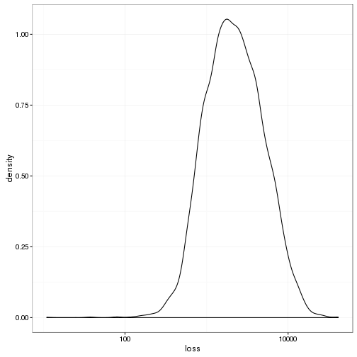
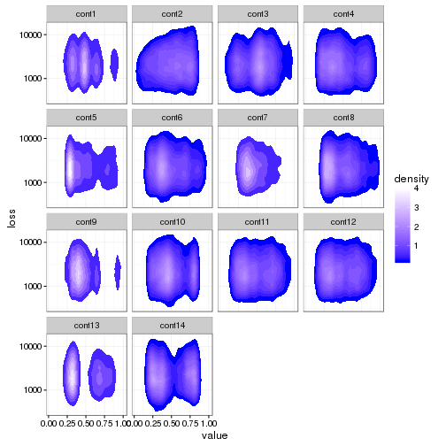

## Preamble

Set working directory.


```r
setwd("~/Projects/Kaggle/AllstateClaimsSeverity/scripts")
```

Load libraries.


```r
library(readr)
library(tibble)
library(plyr)
library(dplyr)
```

```
## 
## Attaching package: 'dplyr'
```

```
## The following objects are masked from 'package:plyr':
## 
##     arrange, count, desc, failwith, id, mutate, rename, summarise,
##     summarize
```

```
## The following objects are masked from 'package:stats':
## 
##     filter, lag
```

```
## The following objects are masked from 'package:base':
## 
##     intersect, setdiff, setequal, union
```

```r
library(reshape2)
library(ggplot2)
library(caret)
```

```
## Loading required package: lattice
```

```r
library(gbm)
```

```
## Loading required package: survival
```

```
## 
## Attaching package: 'survival'
```

```
## The following object is masked from 'package:caret':
## 
##     cluster
```

```
## Loading required package: splines
```

```
## Loading required package: parallel
```

```
## Loaded gbm 2.1.1
```

```r
library(parallel)
library(doParallel)
```

```
## Loading required package: foreach
```

```
## Loading required package: iterators
```

Reproducibility steps.


```r
sessionInfo()
```

```
## R version 3.3.1 (2016-06-21)
## Platform: x86_64-redhat-linux-gnu (64-bit)
## Running under: CentOS release 6.8 (Final)
## 
## locale:
##  [1] LC_CTYPE=en_US.iso885915       LC_NUMERIC=C                  
##  [3] LC_TIME=en_US.iso885915        LC_COLLATE=en_US.iso885915    
##  [5] LC_MONETARY=en_US.iso885915    LC_MESSAGES=en_US.iso885915   
##  [7] LC_PAPER=en_US.iso885915       LC_NAME=C                     
##  [9] LC_ADDRESS=C                   LC_TELEPHONE=C                
## [11] LC_MEASUREMENT=en_US.iso885915 LC_IDENTIFICATION=C           
## 
## attached base packages:
## [1] parallel  splines   stats     graphics  grDevices utils     datasets 
## [8] base     
## 
## other attached packages:
##  [1] doParallel_1.0.10 iterators_1.0.8   foreach_1.4.3    
##  [4] gbm_2.1.1         survival_2.39-5   caret_6.0-71     
##  [7] lattice_0.20-34   ggplot2_2.1.0     reshape2_1.4.1   
## [10] dplyr_0.5.0       plyr_1.8.4        tibble_1.2       
## [13] readr_1.0.0       rmarkdown_1.0     knitr_1.14       
## [16] checkpoint_0.3.16
## 
## loaded via a namespace (and not attached):
##  [1] Rcpp_0.12.7        formatR_1.4        nloptr_1.0.4      
##  [4] methods_3.3.1      tools_3.3.1        digest_0.6.10     
##  [7] lme4_1.1-12        evaluate_0.9       gtable_0.2.0      
## [10] nlme_3.1-128       mgcv_1.8-15        Matrix_1.2-7.1    
## [13] DBI_0.5-1          SparseM_1.72       stringr_1.1.0     
## [16] MatrixModels_0.4-1 stats4_3.3.1       grid_3.3.1        
## [19] nnet_7.3-12        R6_2.1.3           minqa_1.2.4       
## [22] car_2.1-3          magrittr_1.5       scales_0.4.0      
## [25] codetools_0.2-14   htmltools_0.3.5    MASS_7.3-45       
## [28] assertthat_0.1     pbkrtest_0.4-6     colorspace_1.2-6  
## [31] quantreg_5.29      stringi_1.1.1      munsell_0.4.3
```

```r
set.seed(as.integer(as.Date("2016-10-10")))
```

Source user-defined functions.


```r
sapply(list.files("../lib", full.names = TRUE), source)
```

```
##         ../lib/mae.R ../lib/summaryMAE.R
## value   ?            ?                  
## visible FALSE        FALSE
```

---

## Read data

Read the training data.

Using `download.file` and `unzip` returns an error message:


```r
url <- "https://www.kaggle.com/c/allstate-claims-severity/download/train.csv.zip"
f <- tempfile()
download.file(url, f, mode = "wb")
unzip(f, list = TRUE)
```

```
Error in unzip(f, list = TRUE) : 
  zip file 'C:\Users\chanb\AppData\Local\Temp\1\Rtmpohg9qM\filedb017386a2d' cannot be opened
```

So I'll workaround by saving the zip files manually to `../data/raw` and `unzip`ing from there.


```r
unzip("../data/raw/train.csv.zip", exdir = tempdir())
train <- read_csv(file.path(tempdir(), "train.csv"), progress = FALSE)
```

```
## Parsed with column specification:
## cols(
##   .default = col_character(),
##   id = col_integer(),
##   cont1 = col_double(),
##   cont2 = col_double(),
##   cont3 = col_double(),
##   cont4 = col_double(),
##   cont5 = col_double(),
##   cont6 = col_double(),
##   cont7 = col_double(),
##   cont8 = col_double(),
##   cont9 = col_double(),
##   cont10 = col_double(),
##   cont11 = col_double(),
##   cont12 = col_double(),
##   cont13 = col_double(),
##   cont14 = col_double(),
##   loss = col_double()
## )
```

```
## See spec(...) for full column specifications.
```

```r
unzip("../data/raw/test.csv.zip", exdir = tempdir())
test <- read_csv(file.path(tempdir(), "test.csv"), progress = FALSE)
```

```
## Parsed with column specification:
## cols(
##   .default = col_character(),
##   id = col_integer(),
##   cont1 = col_double(),
##   cont2 = col_double(),
##   cont3 = col_double(),
##   cont4 = col_double(),
##   cont5 = col_double(),
##   cont6 = col_double(),
##   cont7 = col_double(),
##   cont8 = col_double(),
##   cont9 = col_double(),
##   cont10 = col_double(),
##   cont11 = col_double(),
##   cont12 = col_double(),
##   cont13 = col_double(),
##   cont14 = col_double()
## )
## See spec(...) for full column specifications.
```

List the columns in both data sets.


```r
merge(data.frame(col = names(train), inTrain = TRUE),
      data.frame(col = names(test), inTest = TRUE),
      by = "col", all = TRUE) %>%
  filter(inTrain & inTest) %>%
  .[, "col"]
```

```
##   [1] cat1   cat10  cat100 cat101 cat102 cat103 cat104 cat105 cat106 cat107
##  [11] cat108 cat109 cat11  cat110 cat111 cat112 cat113 cat114 cat115 cat116
##  [21] cat12  cat13  cat14  cat15  cat16  cat17  cat18  cat19  cat2   cat20 
##  [31] cat21  cat22  cat23  cat24  cat25  cat26  cat27  cat28  cat29  cat3  
##  [41] cat30  cat31  cat32  cat33  cat34  cat35  cat36  cat37  cat38  cat39 
##  [51] cat4   cat40  cat41  cat42  cat43  cat44  cat45  cat46  cat47  cat48 
##  [61] cat49  cat5   cat50  cat51  cat52  cat53  cat54  cat55  cat56  cat57 
##  [71] cat58  cat59  cat6   cat60  cat61  cat62  cat63  cat64  cat65  cat66 
##  [81] cat67  cat68  cat69  cat7   cat70  cat71  cat72  cat73  cat74  cat75 
##  [91] cat76  cat77  cat78  cat79  cat8   cat80  cat81  cat82  cat83  cat84 
## [101] cat85  cat86  cat87  cat88  cat89  cat9   cat90  cat91  cat92  cat93 
## [111] cat94  cat95  cat96  cat97  cat98  cat99  cont1  cont10 cont11 cont12
## [121] cont13 cont14 cont2  cont3  cont4  cont5  cont6  cont7  cont8  cont9 
## [131] id    
## 132 Levels: cat1 cat10 cat100 cat101 cat102 cat103 cat104 cat105 ... loss
```

Check that the columns in `train` are the same as in `test`.
Show the columns that are not in both data sets.


```r
merge(data.frame(col = names(train), inTrain = TRUE),
      data.frame(col = names(test), inTest = TRUE),
      by = "col", all = TRUE) %>%
  filter(is.na(inTrain) | is.na(inTest))
```

```
##    col inTrain inTest
## 1 loss    TRUE     NA
```

---

## Explore `train`

Take a sample for exploration.


```r
sample <- filter(train, id %in% sample(train$id, length(train$id) * 0.05))
```

Plot the density of the `loss` variable.


```r
summary(sample$loss)
```

```
##    Min. 1st Qu.  Median    Mean 3rd Qu.    Max. 
##      11    1226    2138    3036    3903   41150
```

```r
ggplot(sample, aes(x = loss)) +
  geom_density() +
  scale_x_log10() +
  theme_bw()
```



Plot bivariate densities between `loss` and the `cont` variables.


```r
select(sample, matches("id|loss|cont")) %>%
  melt(id.vars = c("id", "loss")) %>%
  ggplot(aes(x = value, y = loss, group = variable)) +
    scale_y_log10() +
    stat_density_2d(aes(fill = ..level..), geom = "polygon") +
    scale_fill_gradient("density", low = "blue", high = "white") +
    facet_wrap(~ variable) +
    theme_bw()
```



Show summary statistics for `cont` variables.


```r
select(sample, matches("cont")) %>% summary()
```

```
##      cont1              cont2              cont3              cont4       
##  Min.   :0.000016   Min.   :0.001503   Min.   :0.002634   Min.   :0.1769  
##  1st Qu.:0.344779   1st Qu.:0.358319   1st Qu.:0.336963   1st Qu.:0.3184  
##  Median :0.475784   Median :0.555782   Median :0.527991   Median :0.4529  
##  Mean   :0.491986   Mean   :0.505485   Mean   :0.499569   Mean   :0.4873  
##  3rd Qu.:0.614340   3rd Qu.:0.681761   3rd Qu.:0.634224   3rd Qu.:0.6333  
##  Max.   :0.977873   Max.   :0.862654   Max.   :0.944251   Max.   :0.9525  
##      cont5            cont6             cont7            cont8       
##  Min.   :0.2811   Min.   :0.01268   Min.   :0.0695   Min.   :0.2369  
##  1st Qu.:0.2811   1st Qu.:0.33506   1st Qu.:0.3502   1st Qu.:0.3180  
##  Median :0.4223   Median :0.43863   Median :0.4357   Median :0.4352  
##  Mean   :0.4882   Mean   :0.48810   Mean   :0.4828   Mean   :0.4846  
##  3rd Qu.:0.6433   3rd Qu.:0.64862   3rd Qu.:0.5895   3rd Qu.:0.6123  
##  Max.   :0.9813   Max.   :0.98902   Max.   :1.0000   Max.   :0.9802  
##      cont9             cont10           cont11            cont12       
##  Min.   :0.00008   Min.   :0.0000   Min.   :0.03532   Min.   :0.03623  
##  1st Qu.:0.35897   1st Qu.:0.3646   1st Qu.:0.30763   1st Qu.:0.30839  
##  Median :0.43318   Median :0.4557   Median :0.45720   Median :0.46229  
##  Mean   :0.48393   Mean   :0.4956   Mean   :0.49070   Mean   :0.49051  
##  3rd Qu.:0.55855   3rd Qu.:0.6146   3rd Qu.:0.67209   3rd Qu.:0.66903  
##  Max.   :0.99133   Max.   :0.9948   Max.   :0.99535   Max.   :0.99455  
##      cont13             cont14      
##  Min.   :0.000228   Min.   :0.1808  
##  1st Qu.:0.315758   1st Qu.:0.2953  
##  Median :0.363547   Median :0.4006  
##  Mean   :0.491356   Mean   :0.4963  
##  3rd Qu.:0.687115   3rd Qu.:0.7249  
##  Max.   :0.948826   Max.   :0.8447
```

The `cont` variables are pre-scaled with values between 0, 0.999998.
Therefore, no preprocessing is needed.

Plot violin plots for `loss` and the `cat` variables.
*This isn't going to work well; there are too many possible values.*


```r
select(sample, matches("cat")) %>%
  melt(id.vars = NULL) %>%
  select(matches("value")) %>%
  unique() %>%
  nrow()
```

```
## [1] 271
```

Check for near-zero variance among the `cat` and `cont` variables.
Exclude these near-zero variances; they likely will not contribute much to prediction.
*May revisit later.*


```r
nearzero <- 
  select(sample, matches("cat|cont")) %>%
    nearZeroVar(saveMetrics = TRUE) %>%
    transform(rowname = rownames(.)) %>%
    filter(zeroVar | nzv)
nearzero
```

```
##     freqRatio percentUnique zeroVar  nzv rowname
## 1    42.79070    0.02124270   FALSE TRUE    cat7
## 2    87.82075    0.02124270   FALSE TRUE   cat14
## 3  4706.50000    0.02124270   FALSE TRUE   cat15
## 4    27.61702    0.02124270   FALSE TRUE   cat16
## 5   116.68750    0.02124270   FALSE TRUE   cat17
## 6   158.57627    0.02124270   FALSE TRUE   cat18
## 7    99.15957    0.02124270   FALSE TRUE   cat19
## 8   940.50000    0.02124270   FALSE TRUE   cat20
## 9   408.34783    0.02124270   FALSE TRUE   cat21
## 10 9414.00000    0.02124270   FALSE TRUE   cat22
## 11   27.53030    0.02124270   FALSE TRUE   cat24
## 12   23.64660    0.02124270   FALSE TRUE   cat28
## 13   49.07979    0.02124270   FALSE TRUE   cat29
## 14   54.05848    0.02124270   FALSE TRUE   cat30
## 15   32.62500    0.02124270   FALSE TRUE   cat31
## 16  153.34426    0.02124270   FALSE TRUE   cat32
## 17  187.30000    0.02124270   FALSE TRUE   cat33
## 18  391.29167    0.02124270   FALSE TRUE   cat34
## 19 1175.87500    0.02124270   FALSE TRUE   cat35
## 20   34.79848    0.02124270   FALSE TRUE   cat39
## 21   20.74365    0.02124270   FALSE TRUE   cat40
## 22   24.65395    0.02124270   FALSE TRUE   cat41
## 23  108.47674    0.02124270   FALSE TRUE   cat42
## 24   41.21973    0.02124270   FALSE TRUE   cat43
## 25   40.11354    0.02124270   FALSE TRUE   cat45
## 26  212.97727    0.02124270   FALSE TRUE   cat46
## 27  275.91176    0.02124270   FALSE TRUE   cat47
## 28  587.43750    0.02124270   FALSE TRUE   cat48
## 29   20.01562    0.02124270   FALSE TRUE   cat49
## 30  150.85484    0.02124270   FALSE TRUE   cat51
## 31   21.10094    0.02124270   FALSE TRUE   cat52
## 32   43.83333    0.02124270   FALSE TRUE   cat54
## 33  783.58333    0.02124270   FALSE TRUE   cat55
## 34  940.50000    0.02124270   FALSE TRUE   cat56
## 35   67.22464    0.02124270   FALSE TRUE   cat57
## 36 1045.11111    0.02124270   FALSE TRUE   cat58
## 37  522.05556    0.02124270   FALSE TRUE   cat59
## 38  494.52632    0.02124270   FALSE TRUE   cat60
## 39  260.52778    0.02124270   FALSE TRUE   cat61
## 40 3137.33333    0.02124270   FALSE TRUE   cat62
## 41 1568.16667    0.02124270   FALSE TRUE   cat63
## 42 1882.00000    0.02124270   FALSE TRUE   cat64
## 43   79.47009    0.02124270   FALSE TRUE   cat65
## 44   22.01956    0.02124270   FALSE TRUE   cat66
## 45  228.63415    0.02124270   FALSE TRUE   cat67
## 46  940.50000    0.02124270   FALSE TRUE   cat68
## 47  552.82353    0.02124270   FALSE TRUE   cat69
## 48 9414.00000    0.02124270   FALSE TRUE   cat70
## 49   19.42299    0.02124270   FALSE TRUE   cat71
## 50   53.09770    0.03186405   FALSE TRUE   cat74
## 51   29.72787    0.03186405   FALSE TRUE   cat76
## 52  425.90909    0.04248540   FALSE TRUE   cat77
## 53  217.02326    0.04248540   FALSE TRUE   cat78
## 54  193.70833    0.04248540   FALSE TRUE   cat85
## 55   45.77114    0.04248540   FALSE TRUE   cat89
## 56   22.49485    0.07434944   FALSE TRUE   cat96
## 57   33.83206    0.06372809   FALSE TRUE  cat102
```

Check how many unique values are in the remaining non-near-zero variance `cat` variables.
*There are still too many possible values.*


```r
select(sample, -matches(paste(c(as.character(nearzero$rowname), "cont", "id", "loss"), collapse = "|"))) %>%
  melt(id.vars = NULL) %>%
  select(matches("value")) %>%
  unique() %>%
  nrow()
```

```
## [1] 271
```

---

## Model the `train` data

Select a subset of non-near-zero variance variables.


```r
train <-
  select(train, -matches(paste(nearzero$rowname, collapse = "|"))) %>%
  select(-matches("id"))
```

Set the control parameters.


```r
ctrl <- trainControl(method = "cv",
                     number = 10,
                     savePredictions = TRUE,
                     allowParallel = TRUE,
                     summaryFunction = summaryMAE)
```


### Regression tree

Fit model over the tuning parameters.


```r
cl <- makeCluster(10)
registerDoParallel(cl)
grid <- expand.grid(interaction.depth = 7:10, 
                    n.trees = seq(500, 800, 100),
                    shrinkage = 0.1,
                    n.minobsinnode = 10)
sapply(list.files("../lib", full.names = TRUE), source)
```

```
##         ../lib/mae.R ../lib/summaryMAE.R
## value   ?            ?                  
## visible FALSE        FALSE
```

```r
trainingModel <- train(loss ~ .,
                       data = train,
                       method = "gbm",
                       trControl = ctrl,
                       tuneGrid = grid,
                       metric = "MAE",
                       maximize = FALSE)
```

```
## Iter   TrainDeviance   ValidDeviance   StepSize   Improve
##      1  7887939.5068            -nan     0.1000 545605.2519
##      2  7440362.0607            -nan     0.1000 452884.8720
##      3  7041230.7973            -nan     0.1000 369458.7312
##      4  6721388.8661            -nan     0.1000 310703.4450
##      5  6455230.8354            -nan     0.1000 258708.0305
##      6  6225830.7394            -nan     0.1000 215031.0729
##      7  6033240.4069            -nan     0.1000 180121.3237
##      8  5859544.0318            -nan     0.1000 159465.2925
##      9  5727130.0835            -nan     0.1000 130129.1907
##     10  5602793.6548            -nan     0.1000 106961.0048
##     20  4920311.3134            -nan     0.1000 41511.7888
##     40  4389561.5397            -nan     0.1000 13062.8924
##     60  4169663.4484            -nan     0.1000 8141.5143
##     80  4058731.6042            -nan     0.1000  143.1159
##    100  3985140.8347            -nan     0.1000 -846.0576
##    120  3926631.8715            -nan     0.1000 1259.2105
##    140  3882267.6753            -nan     0.1000 -505.2132
##    160  3845057.5585            -nan     0.1000 -144.9847
##    180  3808878.6029            -nan     0.1000 -1332.5689
##    200  3781594.9269            -nan     0.1000 -1556.1169
##    220  3759897.2516            -nan     0.1000  -29.5707
##    240  3732850.3931            -nan     0.1000  366.7140
##    260  3711264.2487            -nan     0.1000 -1152.3807
##    280  3692096.7721            -nan     0.1000 -1011.9087
##    300  3673931.6051            -nan     0.1000 -479.9451
##    320  3657785.1825            -nan     0.1000 -877.4660
##    340  3639921.5137            -nan     0.1000   71.9316
##    360  3621861.5830            -nan     0.1000 -880.7226
##    380  3607359.4185            -nan     0.1000 -285.9530
##    400  3591234.3245            -nan     0.1000 -800.9812
##    420  3576487.7328            -nan     0.1000 -1252.2143
##    440  3563627.8492            -nan     0.1000 -1059.8092
##    460  3550722.9157            -nan     0.1000 -106.0036
##    480  3535137.6000            -nan     0.1000 -436.1002
##    500  3523214.0869            -nan     0.1000 -645.0072
##    520  3511489.6254            -nan     0.1000  -11.4830
##    540  3496887.8055            -nan     0.1000 -1069.3784
##    560  3484838.3091            -nan     0.1000 -870.8565
##    580  3472249.6648            -nan     0.1000 -618.6348
##    600  3460015.7624            -nan     0.1000 -474.4692
##    620  3448796.1545            -nan     0.1000 -209.2002
##    640  3436768.4111            -nan     0.1000 -186.4939
##    660  3425446.9851            -nan     0.1000  326.0377
##    680  3413693.7243            -nan     0.1000 -212.1120
##    700  3402528.7235            -nan     0.1000 -476.0897
##    720  3392630.4265            -nan     0.1000 -468.1713
##    740  3382622.6667            -nan     0.1000 -238.3226
##    760  3373739.2400            -nan     0.1000 -823.0952
##    780  3365459.9022            -nan     0.1000 -769.6185
##    800  3356188.5630            -nan     0.1000 -706.2587
```

```r
stopCluster(cl)
```

Evaluate the model on the training dataset.


```r
trainingModel
```

```
## Stochastic Gradient Boosting 
## 
## 188318 samples
##     69 predictor
## 
## No pre-processing
## Resampling: Cross-Validated (10 fold) 
## Summary of sample sizes: 169486, 169486, 169486, 169486, 169487, 169486, ... 
## Resampling results across tuning parameters:
## 
##   interaction.depth  n.trees  MAE     
##    7                 500      1271.627
##    7                 600      1269.833
##    7                 700      1268.058
##    7                 800      1266.737
##    8                 500      1268.483
##    8                 600      1266.371
##    8                 700      1265.450
##    8                 800      1264.120
##    9                 500      1266.091
##    9                 600      1264.392
##    9                 700      1263.303
##    9                 800      1262.084
##   10                 500      1265.126
##   10                 600      1263.979
##   10                 700      1262.839
##   10                 800      1262.057
## 
## Tuning parameter 'shrinkage' was held constant at a value of 0.1
## 
## Tuning parameter 'n.minobsinnode' was held constant at a value of 10
## MAE was used to select the optimal model using  the smallest value.
## The final values used for the model were n.trees = 800,
##  interaction.depth = 10, shrinkage = 0.1 and n.minobsinnode = 10.
```

```r
hat <-
  train %>%
  transform(hat = predict(trainingModel, .)) %>%
  select(matches("loss|hat"))
cor(hat[, c("loss", "hat")])
```

```
##           loss       hat
## loss 1.0000000 0.7764975
## hat  0.7764975 1.0000000
```

```r
postResample(hat$hat, hat$loss)
```

```
##         RMSE     Rsquared 
## 1831.9903283    0.6029484
```

```r
mae(hat$hat, hat$loss)
```

```
## [1] 1210.511
```

```r
ggplot(hat, aes(x = loss, y = hat)) +
  scale_x_log10() +
  scale_y_log10() +
  stat_density_2d(aes(fill = ..level..), geom = "polygon") +
  scale_fill_gradient("density", low = "blue", high = "white") +
  geom_abline(intercept = 0, slope = 1) +
  labs(title = sprintf("R-square = %g, RMSE = %g, MAE = %g",
                       R2(hat$hat, hat$loss),
                       RMSE(hat$hat, hat$loss),
                       mae(hat$hat, hat$loss))) +
  theme_bw()
```

```
## Warning in self$trans$transform(x): NaNs produced
```

```
## Warning: Removed 16 rows containing non-finite values (stat_density2d).
```


Display the final model.


```r
varImp(trainingModel)
```

```
## gbm variable importance
## 
##   only 20 most important variables shown (out of 945)
## 
##         Overall
## cat80B  100.000
## cont7    73.134
## cat80D   46.064
## cont2    31.106
## cat12B   20.868
## cont12   14.283
## cat81D   14.185
## cat87B   13.575
## cont14   11.005
## cont11    9.974
## cat10B    7.801
## cat1B     5.676
## cont3     5.597
## cat53B    4.679
## cat100G   4.252
## cat100I   4.216
## cat2B     3.690
## cont8     3.496
## cat13B    3.468
## cont6     3.408
```

```r
trainingModel$finalModel
```

```
## A gradient boosted model with gaussian loss function.
## 800 iterations were performed.
## There were 945 predictors of which 379 had non-zero influence.
```

Save the artifacts to file.


```r
save(trainingModel, hat, file = "../data/processed/trainingModel.RData")
```
